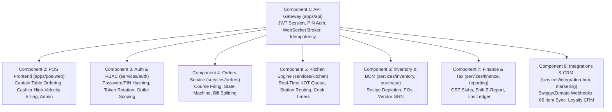

# Kapmeta KapMeta POS & Operations Platform

> **Enterprise-Grade, Multi-Outlet Restaurant POS, Kitchen Engine (KDS), Inventory BOM, GST Finance, and Omni-Channel Aggregator Platform.**

[](LICENSE)
[](docs/03-architecture/)
[](.agents/AGENTS.md)
[](tsconfig.json)
[](apps/pos-web)

---

## 📖 Table of Contents

1. [System Overview](#-system-overview)
2. [Multi-Agent Architecture & Domain Invariants](#-multi-agent-architecture--domain-invariants)
3. [Component & Subtask Breakdown](#-component--subtask-breakdown)
4. [Zero Hardcoding & Dynamic User Ingestion Protocol](#-zero-hardcoding--dynamic-user-ingestion-protocol)
5. [Repository Directory Map](#-repository-directory-map)
6. [Quick Start & Local Development](#-quick-start--local-development)
7. [Database Migrations & Dynamic Seed Scripts](#-database-migrations--dynamic-seed-scripts)
8. [GitHub Synchronization (Push & Pull)](#-github-synchronization-push--pull)
9. [Security, RBAC & Audit Compliance](#-security-rbac--audit-compliance)
10. [SDLC Documentation & Checkpoints](#-sdlc-documentation--checkpoints)

---

## 🌟 System Overview

The **Kapmeta KapMeta POS Platform** is an enterprise restaurant management system designed for speed, resilience, and operational scalability. It bridges front-of-house (Captain table ordering, Cashier 3-column billing), back-of-house (Kitchen Display System with station routing), supply chain (Bill of Materials depletion & Purchase Orders), and financial reconciliation (Indian GST tax engine, Shift Z-Reports, Tips distribution).



---

## 🛡️ Multi-Agent Architecture & Domain Invariants

All development agents (Antigravity, Claude, Gemini) and human contributors adhere strictly to the **Workspace Rules** in [`.agents/AGENTS.md`](.agents/AGENTS.md):

1. **Zero Hardcoded Business Literals:** Never hardcode dishes, prices, categories, recipes, table numbers, tax slabs, customer records, or credentials as static literals. Every operational entity must be ingested and editable via UI or dynamic seed scripts.
2. **Integer Minor Units:** All financial values and monetary amounts are stored and computed in **integer minor units (`BIGINT` paise/cents)** to eliminate floating-point rounding errors.
3. **Multi-Tenant Isolation:** Every table schema and database query enforces **`outlet_id NOT NULL`**.
4. **UUIDv7 Standard:** Primary keys are generated using time-sortable **UUIDv7**.
5. **Domain Isolation:** Services in `services/*` own their specific database domain tables. Direct cross-module table reads are strictly forbidden.
6. **Append-Only Auditing:** Privileged operations (voids, cancellations, 86 status toggles, refunds) write immutable audit records within the same database transaction.

---

## 🧩 Component & Subtask Breakdown

### Component 1: API Gateway & Ingestion Layer (`apps/api`)
- `[API-01]` **Multi-Tenant Session & Scope Resolver:** JWT verification and `outletId` injection.
- `[API-02]` **Distributed Tracing:** `X-Correlation-Id` and `X-Station-Id` header propagation.
- `[API-03]` **Fast Staff PIN Auth:** Low-latency touch-pad authentication (`/auth/pin-login`).
- `[API-04]` **Real-Time WebSocket Broker:** Pushes `KOT_CREATED`, `TABLE_STATUS_CHANGED`, `ITEM_86_TOGGLED`.
- `[API-05]` **Dynamic CRUD Endpoints:** REST routes for menu, tables, inventory, users, and purchase orders.
- `[API-06]` **Idempotency Protection:** Double-charge prevention using cached `X-Idempotency-Key`.

### Component 2: Frontend POS Web Application (`apps/pos-web`)
- **Waiter & Captain Tablet (`/waiter`):**
  - Section-filtered floor map (`AC`, `Non AC`, `Outdoor`).
  - Covers counter stepper `[ − ] 2 Pax [ + ]`.
  - Food photo tiles grid with FSSAI veg/non-veg badges.
  - Modifier customizer sheet (`MenuCustomizerModal.tsx`) for portions, spices, and add-ons.
  - Course tagging & firing (`STARTER`, `MAIN`, `DESSERT`).
  - Offline LAN queue with auto-retry.
  - Waiter shift cash denomination counter & tips calculator (`WaiterCashTipsCalculator.tsx`).
- **Cashier High-Velocity Billing (`PosBillingView.tsx`):**
  - 3-column touch billing layout (Categories, Item Grid, Cart & Settlement).
  - Multi-tender settlement (Cash with change counter, Card, UPI QR, Credit Due).
  - Bill splitting modal (`BillSplitModal.tsx`) by guest count or item assignment.
- **Admin Management Consoles:**
  - Executive revenue & analytics dashboard (`/admin`).
  - Dynamic Menu Ingestion console (`/menu`).
  - Table layout editor (`/table-management`).
  - Staff & RBAC management (`/user-management`).
  - 86 Item out-of-stock live toggle (`/channel-availability`).

### Component 3: Kitchen Display System (`services/kitchen`)
- `[KDS-01]` **Real-Time KOT Generation:** Automatic sequence formatting (`KOT #104`), modifiers, and notes.
- `[KDS-02]` **Station Routing:** Dynamic distribution to `HOT_KITCHEN`, `TANDOOR`, `CHINESE`, `BAR`, `DESSERT`.
- `[KDS-03]` **Kitchen Lifecycle:** Status updates (`PREPARING` ➔ `READY` ➔ `SERVED`) with WebSocket dispatch.
- `[KDS-04]` **Kitchen SLA Tracking:** Prep duration monitoring and delayed ticket highlighting.

### Component 4: Orders & Cart Service (`services/orders`)
- `[ORD-01]` **Monotonic Order Numbering:** Gapless sequences (`20260818-0042`).
- `[ORD-02]` **Strict State Machine:** `PLACED` ➔ `CONFIRMED` ➔ `PREPARING` ➔ `READY` ➔ `SERVED` ➔ `BILLED` ➔ `PAID` ➔ `COMPLETED`.
- `[ORD-03]` **Item Voids & Audit Trail:** Reason codes and manager authorization logging.
- `[ORD-04]` **Deterministic Bill Calculations:** Subtotals, item discounts, CGST/SGST taxes, service charge.

### Component 5: Inventory & BOM Service (`services/inventory`, `services/purchase`)
- `[INV-01]` **Raw Material Catalog:** Metric units (`kg`, `g`, `L`, `ml`, `pcs`) with real-time stock levels.
- `[INV-02]` **Recipe BOM Depletion:** Atomic ingredient stock reduction on KOT confirmation.
- `[INV-03]` **Reorder Threshold Alerts:** Low-stock automated notifications.
- `[INV-04]` **Purchase Orders & GRN:** Supplier PO generation and Goods Received Note stock receipt.

### Component 6: Finance, Tax & Reporting (`services/finance`, `services/reporting`)
- `[FIN-01]` **Indian GST Engine:** Inclusive & exclusive CGST + SGST computation (5%, 12%, 18%).
- `[FIN-02]` **Shift Z-Report:** Opening float, tender breakdowns, payouts, and cash drawer variance.
- `[FIN-03]` **Tip Pool Engine:** Shift tip aggregation and proportional staff distribution.
- `[FIN-04]` **Reporting Engine:** Real-time sales summaries, item margin performance, hourly rush heatmaps.

### Component 7: Omni-Channel Integration & CRM (`services/integration-hub`, `services/marketing`)
- `[INT-01]` **Live 86 Sync:** Synchronized out-of-stock disabling across POS, Zomato, and Swiggy.
- `[INT-02]` **Aggregator Webhook Ingestion:** Swiggy/Zomato webhook parsers injecting orders into the central KOT queue.
- `[INT-03]` **Customer CRM & Loyalty:** Tiered VIP levels (`Bronze`, `Silver`, `Gold`, `Platinum`) and spend-based points.
- `[INT-04]` **Marketing Promo Engine:** Coupon codes (`WELCOME50`, `FLAT100`), time-based happy hour rules.

---

## 🔄 Zero Hardcoding & Dynamic User Ingestion Protocol

In accordance with our zero-hardcoding rules:
- **No static business literals:** Categories, dishes, recipes, ingredients, tables, tax slabs, and user profiles are never hardcoded.
- **Dynamic Seed CLI:** `scripts/seed-dynamic-data.ts` generates realistic restaurant data from structured parameters or user-provided templates.
- **Admin Ingestion Web UI:** Staff can create and edit menus at `/menu`, configure tables at `/table-management`, manage users at `/user-management`, and receive inventory at `/inventory`.
- **REST Endpoints:** Every entity supports standard authenticated JSON CRUD endpoints.

---

## 📁 Repository Directory Map

```text
├── .agents/                 # Workspace Multi-Agent rules and invariants
├── apps/
│   ├── api/                 # Express/TypeScript API Gateway & WebSocket Broker
│   └── pos-web/             # Next.js 14 POS Frontend (Waiter, Cashier, Admin)
├── services/
│   ├── auth/                # Authentication, Staff PIN & RBAC service
│   ├── orders/              # Orders, Cart, Billing & State machine
│   ├── kitchen/             # Kitchen Engine, KDS & Station Routing
│   ├── inventory/           # Inventory Catalog & BOM Recipe Depletion
│   ├── purchase/            # Purchase Orders & Goods Received Notes (GRN)
│   ├── finance/             # Indian GST, Shift Z-Reports & Tip Pool
│   ├── reporting/           # Analytics, Item Margins & Sales Heatmaps
│   ├── integration-hub/     # Swiggy/Zomato Webhooks & 86 Item Sync
│   └── marketing/           # CRM, Loyalty Points & Coupon Promotions
├── packages/
│   ├── types/               # Shared TypeScript schemas & domain models
│   ├── ui-kit/              # Design tokens, modal primitives & styling
│   └── config/              # Shared linting, tsconfig & constants
├── db/
│   ├── migrations/          # PostgreSQL schema migrations (0001-0016)
│   └── seeds/               # Dynamic multi-tenant seed scripts
├── Screen_shot/             # Categorized Reference System Screenshots
│   ├── 01_Billing_Cashier/
│   ├── 02_Online_Orders_Aggregator/
│   ├── 03_KDS_LiveView_Kitchen_Chef/
│   ├── 04_Reports_Admin/
│   ├── 05_Settings_Config_Admin/
│   └── 06_Menu_Inventory_Master_Admin/
├── docs/                    # Complete 17-phase SDLC architecture & specifications
├── scripts/                 # Platform launcher, dynamic seeds & backup scripts
├── CHECKPOINT.md            # Verified build checkpoints & runtime baselines
├── CHANGELOG.md             # Chronological history of platform releases
└── Start_KapMeta.bat       # Production/development platform launcher
```

---

## 🚀 Quick Start & Local Development

### 1. Prerequisites
- **Node.js**: v18.x or v20.x
- **PostgreSQL**: v14+ (Local or Cloud instance)
- **Git**: Installed and configured

### 2. Environment Configuration
Copy the example environment configuration:
```bash
cp .env.example .env
```
Ensure `DATABASE_URL`, `JWT_SECRET`, and `PORT` (default `4001`) are configured.

### 3. Install Dependencies
```bash
npm install
```

### 4. Database Setup & Dynamic Seeds
Run migrations and populate dynamic multi-tenant seed data:
```bash
npm run db:migrate
npm run db:seed
```

### 5. Launch All Services
```bash
# Windows one-click launcher
./Start_KapMeta.bat

# Or start individually:
npm run dev
```

- **API Gateway:** `http://localhost:4001`
- **POS Web (Waiter & Billing):** `http://localhost:3000`
- **Admin Management Console:** `http://localhost:3000/admin`
- **Health Check:** `http://localhost:4001/health`

---

## 🔄 GitHub Synchronization (Push & Pull)

The primary repository is configured at **`https://github.com/metapharsic/Kapmeta_store.git`**.

### Verify Remote Configuration
```bash
git remote -v
# origin  https://github.com/metapharsic/Kapmeta_store.git (fetch)
# origin  https://github.com/metapharsic/Kapmeta_store.git (push)
```

### Pushing Changes to GitHub
To push all committed updates and branches:
```bash
git push -u origin main
```
> **Note on Authentication:** When running `git push` from your terminal, Git will use your GitHub Personal Access Token (PAT) or the Git Credential Manager (GCM) browser login dialog to securely authenticate.

### Pulling Latest Changes from GitHub
To pull upstream updates and keep your local workspace synchronized:
```bash
git pull origin main
```

---

## 🔒 Security, RBAC & Audit Compliance

- **Role-Based Access Control:** Strict permission matrix across `Super Admin`, `Outlet Manager`, `POS Operator`, `Kitchen User`, `Inventory User`, and `Auditor`.
- **Immutable Transaction Auditing:** All sensitive actions (bill voids, item 86 toggles, manager overrides, post-KOT refunds) write audit rows in the same database transaction.
- **Webhook HMAC Validation:** Swiggy/Zomato webhook payloads are verified using HMAC-SHA256 signatures with replay protection.
- **DPDP / Privacy Compliance:** Statutory tax invoice data is preserved while customer PII can be safely scrubbed on demand.

---

## 📑 SDLC Documentation & Checkpoints

Detailed architectural documents, engineering protocols, and decision records:
- [`docs/START-HERE.md`](docs/START-HERE.md) — System entry point and role-based reading guide.
- [`docs/03-architecture/component-subtasks-and-multi-agent-spec.md`](docs/03-architecture/component-subtasks-and-multi-agent-spec.md) — Complete 8-component architectural wiring.
- [`docs/08-security/security-framework.md`](docs/08-security/security-framework.md) — Security, RBAC matrix, and threat model.
- [`CHECKPOINT.md`](CHECKPOINT.md) — Verified milestone checkpoints and build status.
- [`CHANGELOG.md`](CHANGELOG.md) — Version history and operational release notes.

---
*Maintained by the Kapmeta Architecture Team & Multi-Agent Pair Programming System.*
