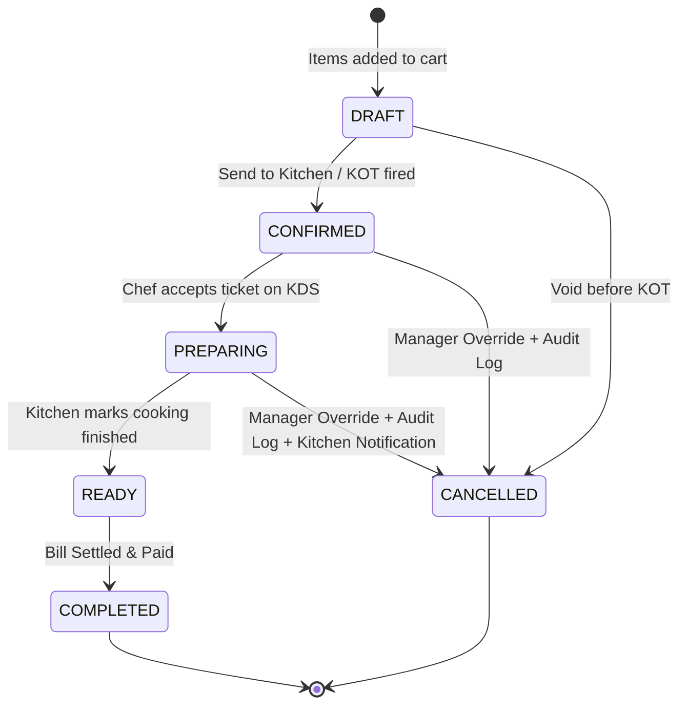
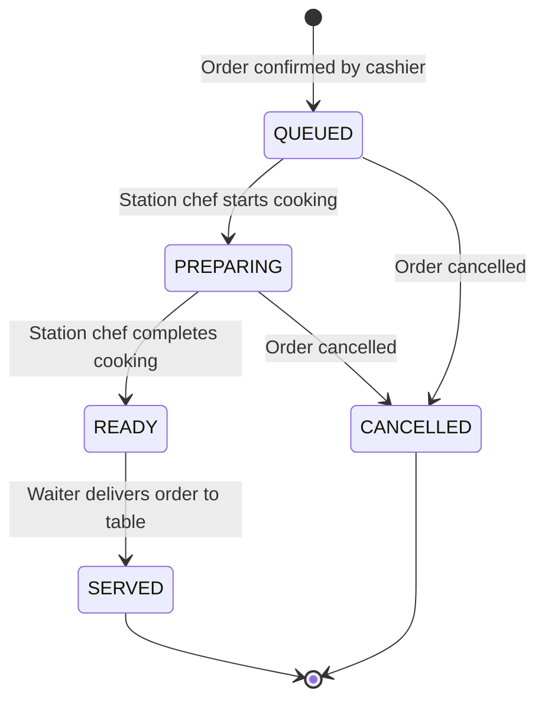
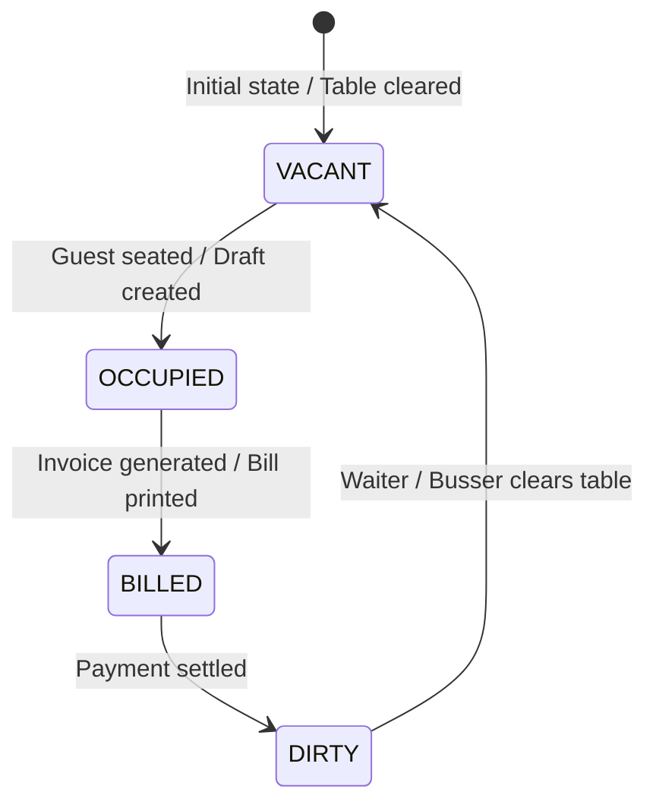

# KapMeta POS Platform — State Machines & Transition Rules

**For:** Gemini, Claude & AI Coding Agents  

---

## 1. Order State Machine

### Transition Invariants:
1. Moving from `DRAFT` to `CONFIRMED` fires the `order.confirmed` event and creates kitchen tickets.
2. An order cannot transition to `COMPLETED` unless full settlement is recorded in `Payment` equal to `totalAmount`.
3. Any transition to `CANCELLED` from `CONFIRMED` or `PREPARING` requires privileged authorization and writes an `AuditLog` entry in the same transaction.

---

## 2. Kitchen KOT Ticket State Machine

---

## 3. Dine-In Table State Machine

