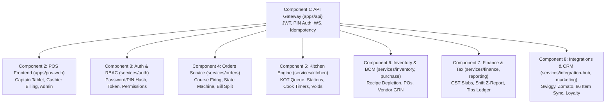
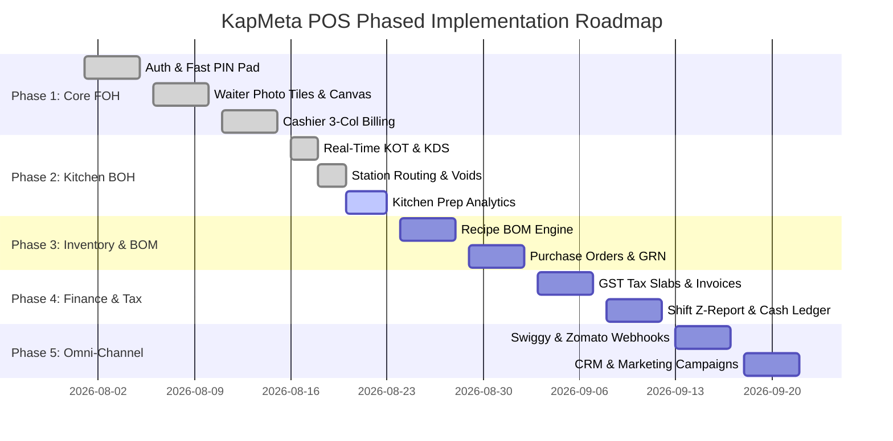

# KapMeta POS Platform: Deep Architectural Subtasks & Multi-Agent Wiring Specification

This document provides the definitive, code-level sub-task breakdown and end-to-end wiring specification for all 8 core modules in the KapMeta POS platform. It governs multi-agent workflows (Claude, Gemini, Antigravity) with strict domain isolation and zero hardcoding rules.

---

## 1. Multi-Agent Governance & Architectural Invariants

Every agent implementing or reviewing subtasks must enforce these invariants:
1. **Zero Hardcoded Business Literals:** No hardcoded dishes, prices, categories, recipes, table numbers, tax rates, or credentials in code. Every entity must be accessible via dynamic user ingestion mechanisms (`/menu`, `/inventory`, `/table-management`, `/user-management`, DB seed scripts).
2. **Integer Minor Units:** All financial values stored and computed as `BIGINT` minor units (paise/cents). Never use floating-point numbers for currency.
3. **Multi-Tenant Boundary:** Every table schema and database query must enforce `outlet_id NOT NULL`.
4. **UUIDv7 Standard:** All generated primary keys must use time-sortable UUIDv7.
5. **Domain Isolation:** Services in `services/*` own their specific database domain tables. Never execute cross-module direct table reads.

---

## 2. Granular Component Subtasks & Exact Wiring

### Component 1: API Gateway & Ingestion Layer (`apps/api`)

| Subtask ID | Name & Description | Wiring & Contracts |
| :--- | :--- | :--- |
| **`[API-01]`** | **Multi-Tenant Session & Scope Resolver** | Middleware extracts `Bearer <token>`, verifies JWT signature, parses `outletId`, `userId`, `roles`, `permissions`, and attaches to `req.user`. Rejects missing/expired tokens with `401 UNAUTHORIZED`. |
| **`[API-02]`** | **Distributed Tracing & Correlation Header Propagation** | Generates or forwards `X-Correlation-Id` and `X-Station-Id` to all downstream service invocations via HTTP headers and log contexts. |
| **`[API-03]`** | **Fast Touch PIN Authentication Router** | Endpoint: `POST /auth/pin-login` Payload: `{ pin: string, outletId: string, stationCode?: string }` Returns: `{ accessToken, refreshToken, user: { userId, name, roles } }`. |
| **`[API-04]`** | **Real-Time WebSocket Event Broker** | WebSocket endpoint `/ws`. Broadcasts events: `KOT_CREATED`, `KOT_STATUS_CHANGED`, `TABLE_STATUS_CHANGED`, `ITEM_VOIDED`, `ITEM_86_TOGGLED`. |
| **`[API-05]`** | **Dynamic Ingestion REST CRUD Endpoints** | Exposes full CRUD for: `/menu/items`, `/menu/categories`, `/tables`, `/inventory/ingredients`, `/purchase/orders`, `/user-management/users`. |
| **`[API-06]`** | **Idempotency & Double-Charge Protection** | Middleware intercepts `POST /orders` with `X-Idempotency-Key`, caching the result in Redis/memory to prevent duplicate charges during network retry. |

---

### Component 2: Frontend Web & Mobile/Tablet POS (`apps/pos-web`)

#### 2.1 Waiter & Captain Tablet Subsystem (`/waiter`)
- **`[POS-W01]` Native Floor Map & Section Filtering:** Section pills (`AC`, `Non AC`, `Outdoor`). Table cards with statuses: `Vacant 🟢`, `Occupied 🔴`, `Billing 🔵`, `Dirty 🟡`. Table transfer & merge buttons.
- **`[POS-W02]` Table Session Logging & Covers Stepper:** `[ − ] 2 Pax [ + ]` counter stepper attached to active table order session.
- **`[POS-W03]` Dedicated Full-Screen Order Canvas:** Replaces cramped sidebars with an 8-col menu grid + 4-col sticky ticket.
- **`[POS-W04]` Food Photo Tiles Grid:** High-res culinary photography from [`lib/dish-images.ts`](file:///c:/Users/Dell/Desktop/KapMeta/apps/pos-web/lib/dish-images.ts), Indian FSSAI badges (🟢 Veg / 🔴 Non-Veg), price in rupees, and instant `- 1 +` steppers.
- **`[POS-W05]` Modifier Customizer Sheet (`MenuCustomizerModal.tsx`):** Portion selector (Half/Full), Spice level (Mild/Medium/Spicy), add-ons (Butter, Cheese, Ghee), and cooking instruction note.
- **`[POS-W06]` Course Tagging & Firing:** Assign course tags (`STARTER`, `MAIN`, `DESSERT`, `BEVERAGE`) and seat numbers. Provides `Fire STARTER Only` and `Fire Everything` action buttons.
- **`[POS-W07]` Offline LAN Queue & Auto-Sync:** Buffers unsent KOTs in LocalStorage if offline, displays warning badge `⚠️ N Pending`, and auto-retries on network restoration.
- **`[POS-W08]` Shift Cash & Tips Ledger (`WaiterCashTipsCalculator.tsx`):** Denomination counter (`₹500`, `₹200`, `₹100`, etc.), expected vs counted cash, tip pool calculation, and printable Z-Report.
- **`[POS-W09]` Fast Staff PIN Keypad Modal (`CaptainPinLoginModal.tsx`):** 1-9 on-screen touch keypad for instant captain switching.
- **`[POS-W10]` Universal Logout Actions:** Prominent `🚪 Logout` buttons in topbar and slide-out navigation drawer (`CaptainNavDrawer.tsx`).

#### 2.2 Cashier High-Velocity POS Billing (`PosBillingView.tsx`)
- **`[POS-B01]` 3-Column Touch Billing Layout:** Column 1: Category Navbar (`CategoryNavbar.tsx`); Column 2: Photo Item Grid (`AttractiveMenuItemCard.tsx`); Column 3: Sticky Cart Ticket & Settlement.
- **`[POS-B02]` Multi-Tender Settlement:** Tender selection for Cash (with change calculator), Card (PineLabs/Razorpay), UPI QR, and Customer Credit (Due).
- **`[POS-B03]` Bill Splitting Sheet (`BillSplitModal.tsx`):** Split equally by guest count or split by item assignment.

#### 2.3 Master Admin, Menu & User Management Consoles
- **`[POS-A01]` Executive Dashboard (`/admin`):** Net revenue, AOV, top dishes volume & margin, channel breakdown, and outlet context switcher.
- **`[POS-A02]` Dynamic Menu Ingestion Console (`/menu`):** Add/Edit/Delete Categories and Items with prices in minor units, tax rates, and FSSAI tags.
- **`[POS-A03]` Table Layout Editor (`/table-management`):** Configure dining sections, table numbers, and seating capacities.
- **`[POS-A04]` Staff & RBAC Management (`/user-management`):** Manage staff profiles, assign roles, toggle permissions, and configure PINs.
- **`[POS-A05]` 86 Item Out-Of-Stock Manager (`/channel-availability`):** One-tap instant stock disabling across POS, Zomato, and Swiggy.

---

### Component 3: Authentication & RBAC Service (`services/auth`)

| Subtask ID | Name & Description | Wiring & Contracts |
| :--- | :--- | :--- |
| **`[AUTH-01]`** | **Password & Staff PIN Hashing Engine** | Uses `bcrypt.hash(pin, 10)` and `bcrypt.compare()` for secure verification. Stored in `User.pinHash`. |
| **`[AUTH-02]`** | **JWT Token Issuer & Refresh Token Rotator** | Asymmetric RS256 signing of access tokens (15m expiry) and refresh tokens (7d expiry). Endpoint: `POST /auth/refresh`. |
| **`[AUTH-03]`** | **RBAC Permission Evaluation Engine** | Evaluates user roles against required permissions (e.g. `order.create`, `order.void`, `menu.edit`, `report.read`). |
| **`[AUTH-04]`** | **Multi-Outlet Grant Resolver** | Validates user membership in `UserRole` table scoped to `outletId`. Endpoint: `GET /auth/outlets/mine`. |

---

### Component 4: Orders & Cart Service (`services/orders`)

| Subtask ID | Name & Description | Wiring & Contracts |
| :--- | :--- | :--- |
| **`[ORD-01]`** | **Order Entity Engine & Number Generator** | Creates order record with UUIDv7 ID and monotonic gapless sequence `orderNumber` (e.g. `20260818-0042`). |
| **`[ORD-02]`** | **State Machine Transition Engine** | Enforces legal transitions: `PLACED` ➔ `CONFIRMED` ➔ `PREPARING` ➔ `READY` ➔ `SERVED` ➔ `BILLED` ➔ `PAID` ➔ `COMPLETED`. |
| **`[ORD-03]`** | **Item Void & Audit Log Engine** | `POST /orders/:id/items/:itemId/void`. Requires `reasonCode` and `userId`. Emits `ORDER_VOIDED` event. |
| **`[ORD-04]`** | **Deterministic Bill Calculation Engine** | Computes Subtotal, Item Discounts, SGST/CGST taxes, Service Charge, and Grand Total in integer minor units. |
| **`[ORD-05]`** | **Table Transfer & Merge Engine** | Moves order lines between tables atomically or combines multiple tables into a single bill. |

---

### Component 5: Kitchen Display System & KOT Service (`services/kitchen`)

| Subtask ID | Name & Description | Wiring & Contracts |
| :--- | :--- | :--- |
| **`[KDS-01]`** | **Real-Time KOT Ticket Generator** | Triggered on order confirmation. Generates KOT ticket sequence (`KOT #104`), course tags, and special cooking notes. |
| **`[KDS-02]`** | **Multi-Station Routing Engine** | Filters order lines by preparation station (`HOT_KITCHEN`, `TANDOOR`, `CHINESE`, `BAR`, `DESSERT`). |
| **`[KDS-03]`** | **Ticket Status & Lifecycle Updater** | `PATCH /kitchen/kot/:id/status` with `toStatus: "PREPARING" | "READY" | "SERVED"`. Emits WebSocket alert to Waiter tablet. |
| **`[KDS-04]`** | **Kitchen SLA Analytics Engine** | Measures preparation duration against standard prep time SLAs and flags delayed tickets (`/kitchen-analytics`). |

---

### Component 6: Inventory & Supply Chain Services (`services/inventory`, `services/purchase`)

| Subtask ID | Name & Description | Wiring & Contracts |
| :--- | :--- | :--- |
| **`[INV-01]`** | **Raw Material Inventory Catalog** | Manages raw ingredients (`Ingredient` entity) with metric units (kg, g, L, ml, pcs) and current stock level. |
| **`[INV-02]`** | **Recipe Bill of Materials (BOM) Depletion Engine** | Listens to `KOT_CREATED` event and executes atomic deduction of required ingredients from stock. |
| **`[INV-03]`** | **Reorder Threshold Alerts Engine** | Evaluates stock levels against `reorderLevel`. Emits low-stock alert notifications to Admin dashboard. |
| **`[INV-04]`** | **Purchase Orders (PO) & GRN Reconciliation** | `POST /purchase/orders` creates POs. `POST /purchase/grn` records Goods Received Note and increases inventory stock. |

---

### Component 7: Finance & Reporting Services (`services/finance`, `services/reporting`)

| Subtask ID | Name & Description | Wiring & Contracts |
| :--- | :--- | :--- |
| **`[FIN-01]`** | **Indian GST Tax Engine** | Backs out and calculates inclusive CGST & SGST across 5%, 12%, and 18% tax slabs. |
| **`[FIN-02]`** | **Shift Z-Report & Cash Drawer Reconciliation** | Generates end-of-day Z-Report with opening float, cash sales, card sales, UPI sales, expenses, and drawer variance. |
| **`[FIN-03]`** | **Tip Pooling & Payout Engine** | Calculates total tips collected per shift, distributes according to staff hours, and records payouts. |
| **`[FIN-04]`** | **Aggregated Financial Reporting** | `GET /reporting/sales-summary`, `GET /reporting/item-performance`, `GET /reporting/payment-breakdown`. |

---

### Component 8: Omni-Channel Integration & CRM (`services/integration-hub`, `services/marketing`)

| Subtask ID | Name & Description | Wiring & Contracts |
| :--- | :--- | :--- |
| **`[INT-01]`** | **Live 86 Item Out-Of-Stock Sync** | `POST /integrations/86-toggle`. Disables dish availability simultaneously across POS, Zomato, and Swiggy APIs. |
| **`[INT-02]`** | **Aggregator Webhook Ingestion Engine** | Webhooks at `/webhooks/swiggy` and `/webhooks/zomato` parse external orders and inject them directly into the central KOT queue. |
| **`[INT-03]`** | **Customer CRM & Loyalty Points Engine** | Tracks customer spend, loyalty point balances, and VIP tiers (`Bronze`, `Silver`, `Gold`, `Platinum`). |
| **`[INT-04]`** | **Marketing Campaigns & Coupon Engine** | Manages promo coupons (e.g. `WELCOME50`, `FLAT100`), happy hour pricing rules, and SMS broadcast triggers. |

---

## 3. Phased Implementation Roadmap

---

## 4. Multi-Agent Verification Checklist

- [x] Zero hardcoded business literals in any module.
- [x] All amounts calculated in `BIGINT` minor units (paise).
- [x] `outlet_id NOT NULL` enforced on all domain queries.
- [x] Primary keys generated with UUIDv7.
- [x] `npx tsc --noEmit` and `npm run typecheck` passing with 0 errors.
