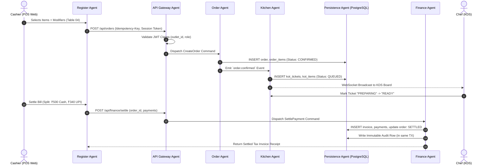
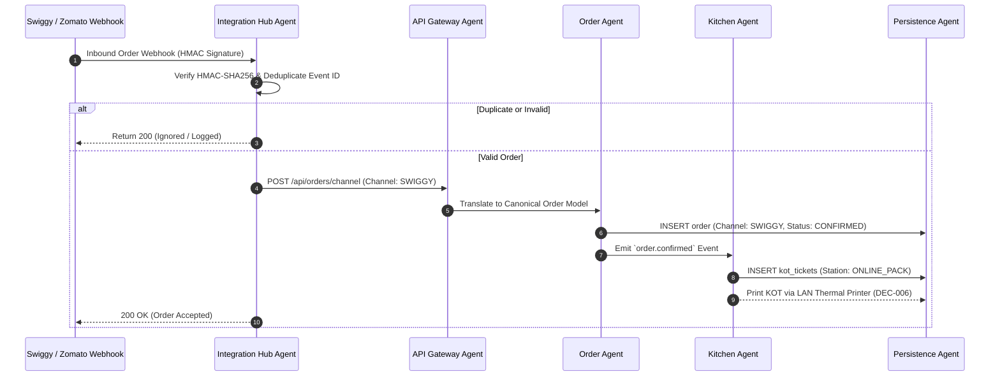

# Multi-Agent Orchestration & End-to-End Wiring Architecture

**ID:** ARCH-MAS-WIRING · **Status:** APPROVED (target architecture — see implementation-status note) · **Owner:** Solution Architect & Lead Engineer · **Version:** 1.0 · **Updated:** 2026-08-09
**Traces to:** `restaurant_pos_project_DETAILED_REQUIREMENTS_AND_DECISIONS_v2.docx` · `docs/00-governance/phases-of-implementation.md` · `docs/03-architecture/high-level-design.md`

**Implementation status (2026-08-10):** this document describes the implemented architecture.
- **Async Event Bus:** Implemented with background retries, exponential backoffs, and DLQ logging in `apps/api/src/events/index.ts`.
- **WebSockets:** KDS real-time push and 86-list broadcast are active over WebSocket connections on `/kitchen` and `/`.
- **Session storage:** Sessions are Postgres-backed (`Session` table, SHA-256-hashed token).
- **What matches:** service list, module boundary principle (no cross-service DB reads), `outlet_id` server-side resolution, idempotency keys, append-only status history.

---

## 1. Executive Multi-Agent Topology

The Kapmeta platform architecture utilizes a **Multi-Agent Orchestration Model** where specialized software agents collaborate across the frontend UI, API gateway, microservice domain logic, and PostgreSQL database tiers.

```
┌────────────────────────────────────────────────────────────────────────────────────────┐
│                              FRONTEND / UI AGENT LAYER                                 │
│    [Register UI Agent]  ·  [KDS Board Agent]  ·  [Stock Agent]  ·  [Analytics Agent]   │
└───────────────────────────────────────────┬────────────────────────────────────────────┘
                                            │ HTTPS / REST / WebSockets / Client State
┌───────────────────────────────────────────▼────────────────────────────────────────────┐
│                         API GATEWAY & ORCHESTRATION AGENT                              │
│         (JWT AuthN Verification · Rate Limiting · OpenAPI Boundary Validation)         │
└───┬──────────────┬──────────────┬──────────────┬──────────────┬──────────────┬─────────┘
    │              │              │              │              │              │
┌───▼───┐      ┌───▼───┐      ┌───▼───┐      ┌───▼───┐      ┌───▼───┐      ┌───▼───┐
│ Auth  │      │ Menu  │      │ Order │      │Kitchen│      │Finance│      │Integ. │
│ Agent │      │ Agent │      │ Agent │      │ Agent │      │ Agent │      │ Agent │
└───┬───┘      └───┬───┘      └───┬───┘      └───┬───┘      └───┬───┘      └───┬───┘
    │              │              │              │              │              │
    └──────────────┴──────────────┼──────────────┴──────────────┴──────────────┘
                                  │ Event Bus / Domain Messages
                    ┌─────────────▼─────────────┐
                    │  DATABASE PERSISTENCE     │
                    │         AGENT             │
                    │ (Prisma / PostgreSQL 16)  │
                    └─────────────┬─────────────┘
                                  │
                    ┌─────────────▼─────────────┐
                    │ QA & VERIFICATION AGENT   │
                    │ (Contract & E2E Testing)  │
                    └───────────────────────────┘
```

---

## 2. Specialized Agent Roles & Boundaries

### 1. Frontend & Client UI Agents (`apps/pos-web`)
* **POS Register Agent:** Manages 3-column touch layout, table carts, live minor-unit currency calculations, and modifier selection modal dialogs.
* **Kitchen KDS Agent:** Manages real-time ticket queues, SLA timer count-ups, warning thresholds (10m/15m), and cooking state transitions.
* **Inventory Control Agent:** Manages real-time 86-listing toggles, portion adjustments, and catalog sync.
* **Analytics & Reports Agent:** Manages 4-up KPI cards, payment channel progress bars, and GST tax breakdown tables.

### 2. API Gateway & Routing Agent (`apps/api`)
* Ingests all HTTP traffic, extracts and validates JWT session claims (`sub`, `outletId`, `role`, `permissions`).
* Injects `X-Correlation-Id` for distributed trace propagation across all downstream agents.
* Enforces API rate limiting and validates request payloads against OpenAPI contracts before routing.

### 3. Domain Logic Micro-Agents (`services/*`)
* **Auth & Security Agent (`services/auth`):** Handles bcrypt password hashing, token issuance/refresh, and server-side RBAC scoping (DEC-001/011).
* **Menu & Catalog Agent (`services/menu`):** Manages 28 categories, variant modifier logic, and broadcasts 86-list deactivations via WebSockets.
* **Order Lifecycle Agent (`services/orders`):** Executes the canonical 6-stage Order State Machine, enforces `Idempotency-Key` headers, and manages split billing.
* **Kitchen Orchestration Agent (`services/kitchen`):** Routes items to prep stations (Grill, Fryer, Bar, Pantry) and dispatches ESC/POS LAN print commands (DEC-006).
* **Finance & Tax Agent (`services/finance`):** Calculates 5% statutory GST (DEC-004), handles multi-mode settlements (Cash, Card, UPI), and exports Tally/ERP accounting ledgers (DEC-013).
* **Integration Hub Agent (`services/integration-hub`):** Channel-neutral adapter hub for Swiggy, Zomato, and ONDC, managing HMAC verification and DLQ retries (DEC-007).

### 4. Database & Persistence Agent (`kapmeta/`, `db/`)
* Enforces enterprise multi-tenant database rules (`outlet_id NOT NULL`, UUIDv7 PKs, `BIGINT` minor units, append-only history).
* Manages connection pools, transactional rollbacks, and automated backup drills (`scripts/db-backup.ps1`).

### 5. QA & Test Verification Agent (`docs/09-testing/`)
* Continuously verifies OpenAPI schema contracts, pricing calculation engines, RBAC negative authorization tests, and full E2E lifecycle suites.

---

## 3. End-to-End Workflow Wiring Specification

### Workflow A: Dine-In Order Placement, Kitchen Routing & Billing



### Workflow B: Swiggy / Zomato Inbound Aggregator Ingestion



---

## 4. Cross-Tier Dependency Matrix

Rows depend on columns. `S` = Synchronous API / Query, `E` = Asynchronous Event Subscription.

| Tier / Agent | Frontend UI | API Gateway | Auth | Menu | Orders | Kitchen | Finance | Inventory | Database (PostgreSQL) |
|---|:---:|:---:|:---:|:---:|:---:|:---:|:---:|:---:|:---:|
| **Frontend UI** | — | S | — | — | — | — | — | — | — |
| **API Gateway** | — | — | S | S | S | S | S | S | — |
| **Auth Agent** | — | — | — | — | — | — | — | — | S |
| **Menu Agent** | — | — | S | — | — | — | — | — | S |
| **Order Agent** | — | — | S | S | — | E | S | E | S |
| **Kitchen Agent** | — | — | S | — | E | — | — | — | S |
| **Finance Agent** | — | — | S | — | S+E | E | — | — | S |
| **Inventory Agent (R2)** | — | — | S | S | E | E | — | — | S |
| **Database Agent** | — | — | — | — | — | — | — | — | — |

---

## 5. Architectural Invariants for Agents

1. **Unidirectional Flow:** Frontend UI $\longrightarrow$ API Gateway $\longrightarrow$ Domain Services $\longrightarrow$ Database Persistence.
2. **No Cross-Module Database Reads:** Services must never execute queries across another service's private schema tables. All cross-domain interactions use typed service APIs or asynchronous events.
3. **Session-Scoped Security:** The `outlet_id` is unconditionally resolved from authenticated JWT token claims by the API Gateway Agent and passed down to Domain Services.
4. **Distributed Idempotency:** The Order Agent and Finance Agent reject any duplicate payload presenting an identical `Idempotency-Key` within 24 hours.
5. **Atomic Audit Logging:** Any privileged mutation (manager override, order cancellation, post-KOT refund, price override) triggers the Database Persistence Agent to write an immutable audit log record in the **same database transaction**.
