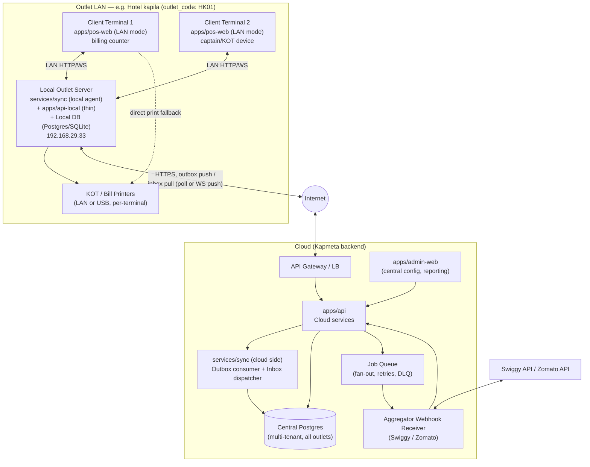
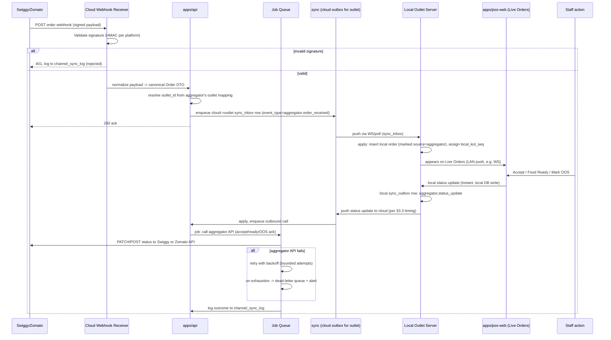

# 07 — Offline-First Sync & System Architecture

Status: DRAFT — Phase 2/3 Architecture deliverable
Owner: Architecture (feeds `docs/03-architecture/`, `infra/`)
Inputs: 86-screenshot validation of KapMeta desktop POS at outlet "Hotel kapila" (see Phase 0 discovery notes)
Scope: `services/sync`, `apps/pos-web` (LAN client), `apps/api` (cloud), local outlet server, `infra/`

Labeling convention used throughout: **[EVIDENCE]** = directly supported by a screenshot; **[PROPOSAL]** = senior-engineer recommendation filling a gap the screenshots don't resolve; **[OPEN]** = flagged for the decision register, not decided here.

---

## 1. Topology

**[EVIDENCE]** The System Configuration → Machines screen shows a "Main Server" (192.168.29.33) and a "Client Machine (You)" (192.168.29.236) on the same subnet — this is a LAN client-server desktop app per outlet, not a thin cloud-only client.



Key property: **the outlet LAN is a fully functional island.** The internet link (outlet ⇄ cloud) can be down indefinitely without stopping billing, KOT printing, or table management at that outlet.

---

## 2. Local-first write path — order/KOT creation with zero internet

**[EVIDENCE]** KOT/bill printing must work offline (kitchen can't wait); this drives all of section 2.

Sequence when a cashier/captain creates an order on a client terminal:

1. **Client terminal (`apps/pos-web`, LAN mode)** builds the order in local UI state (items, modifiers, table, covers).
2. Client calls the **Local Outlet Server** over LAN (`POST /local/orders`) — never the cloud directly for order creation. Cloud connectivity state is irrelevant at this step.
3. **Local Outlet Server**:
   a. Validates against **locally cached** menu/price/tax config (see §4 for how that cache is kept fresh — it's the cloud → local sync direction).
   b. Assigns `local_order_seq` and `kot_seq` from a **local, per-outlet, monotonic sequence** (§4).
   c. Writes the order row + order_items + KOT row to the **local DB** in a single transaction. This local write is the durability boundary — the order is "safe" the instant this commits, regardless of internet state.
   d. Appends a row to **`sync_outbox`** (same local transaction — outbox pattern, §3) representing "order created" as a fact to eventually push to cloud.
   e. Returns success to the client with the generated bill/KOT numbers.
4. Local Outlet Server immediately triggers **local printing** (KOT to kitchen printer, bill to billing printer) using locally stored printer/format settings — no cloud round trip.
5. Client terminal renders confirmation; cashier moves on. Total added latency for cloud is **zero** — cloud interaction happens asynchronously after step 3d.
6. **Asynchronously**, the local server's sync agent drains `sync_outbox` and pushes to cloud when internet is available (§3). If internet has been down for hours, the queue simply grows (bounded by local disk, monitored — §9) and drains on reconnect.

This gives: order durability = local disk fsync; kitchen operations = fully offline-capable; cloud = eventually-consistent mirror + reporting/aggregation layer, never a dependency for the happy path.

**[PROPOSAL]** Local DB technology: Postgres for the local server (not SQLite) if the local server is a persistent service process, to reuse the same schema/migration tooling as cloud (`db/migrations`) and support the multi-client-terminal concurrent-write pattern cleanly. SQLite is acceptable as a fallback for very small single-terminal outlets but complicates schema parity — recommend standardizing on Postgres and treating this as an **[OPEN]** decision if hardware at small outlets can't run it.

---

## 3. Bidirectional sync protocol — outbox/inbox design

### 3.1 Direction: local → cloud

Flows up: new/updated orders, payments, day-end (Z-report) closures, audit logs, printer/health heartbeats, KOT status changes, aggregator order status updates initiated locally (food ready, accepted), local settings changes made at the outlet (if allowed — see §3.4 open decision).

### 3.2 Direction: cloud → local

Flows down: menu/price/tax/billing/print config changes made centrally in `admin-web`, aggregator webhook orders (Swiggy/Zomato) that must appear on Live Orders, remote admin commands (force logout, force resync, disable outlet, push app update notice), OOS toggles initiated from another channel/outlet-group level.

### 3.3 Mechanism: outbox pattern + change queue, not raw CDC

**[PROPOSAL]** Use an **application-level outbox/inbox pattern** (not DB-level CDC/logical replication) because:
- The local server must work fully disconnected for arbitrary durations — CDC replication slots degrade badly over long disconnects (WAL retention).
- Outbox gives us explicit idempotency keys and payload versioning per business event, which raw row-level CDC doesn't.
- Both sides are the same team's schema, so we can standardize the outbox contract instead of diffing tables.

**Local server tables:**

```sql
-- Outbound: local facts waiting to be pushed to cloud
CREATE TABLE sync_outbox (
    id                BIGSERIAL PRIMARY KEY,
    outlet_id         UUID NOT NULL,
    idempotency_key   UUID NOT NULL UNIQUE,        -- generated at creation, survives retries
    event_type        TEXT NOT NULL,               -- 'order.created','order.updated','payment.captured',
                                                     -- 'dayend.closed','audit.logged','aggregator.status_update', ...
    entity_id         UUID NOT NULL,               -- e.g. local order id
    payload           JSONB NOT NULL,
    payload_version   SMALLINT NOT NULL DEFAULT 1,
    created_at        TIMESTAMPTZ NOT NULL DEFAULT now(),
    attempt_count     INT NOT NULL DEFAULT 0,
    last_attempt_at   TIMESTAMPTZ,
    last_error        TEXT,
    status            TEXT NOT NULL DEFAULT 'pending' -- pending | in_flight | acked | failed_permanent
);
CREATE INDEX ON sync_outbox (status, created_at);

-- Inbound: cloud facts waiting to be applied locally
CREATE TABLE sync_inbox (
    id                BIGSERIAL PRIMARY KEY,
    outlet_id         UUID NOT NULL,
    idempotency_key   UUID NOT NULL UNIQUE,        -- set by cloud producer
    event_type        TEXT NOT NULL,               -- 'menu.updated','tax.updated','print_settings.updated',
                                                     -- 'aggregator.order_received','admin.command', ...
    payload           JSONB NOT NULL,
    payload_version   SMALLINT NOT NULL DEFAULT 1,
    received_at       TIMESTAMPTZ NOT NULL DEFAULT now(),
    applied_at        TIMESTAMPTZ,
    status            TEXT NOT NULL DEFAULT 'pending' -- pending | applied | rejected | superseded
);
CREATE INDEX ON sync_inbox (status, received_at);

-- Cursor/watermark bookkeeping per direction, per outlet
CREATE TABLE sync_state (
    outlet_id             UUID PRIMARY KEY,
    last_outbox_id_pushed BIGINT NOT NULL DEFAULT 0,
    last_inbox_seq_pulled BIGINT NOT NULL DEFAULT 0,  -- cloud-assigned monotonic seq per outlet
    last_success_at       TIMESTAMPTZ,
    last_attempt_at       TIMESTAMPTZ,
    consecutive_failures  INT NOT NULL DEFAULT 0
);
```

Cloud side mirrors this with `sync_outbox_cloud` (cloud → outlet direction, keyed by `outlet_id`) and an ingestion table that dedupes inbound local events by `idempotency_key` before applying to `Central Postgres`.

**Transport [PROPOSAL]:**
- Local → cloud: **push**, local sync agent polls its own `sync_outbox` every N seconds (config, default 15s) and POSTs a batch to `apps/api` `/sync/push`. Cloud acks per-`idempotency_key`; local marks acked rows `acked` (or deletes/archives after a retention window — keep 30 days for audit before purge).
- Cloud → local: prefer a **persistent WebSocket/long-poll** from outlet to cloud (outlet-initiated, since outlets are typically behind NAT/no inbound port) carrying inbox events in near-real-time when connected, **plus** a fallback poll (`GET /sync/pull?since=<seq>`) every N seconds so a WS drop doesn't stall delivery. This matters most for aggregator orders, which are latency-sensitive (Live Orders SLA).
- Batch size capped (e.g. 200 events or 2MB) to keep individual sync round trips bounded even after a long outage with a large backlog.

### 3.4 Conflict resolution

- **Orders, payments, audit logs, day-end reports: append-only, no conflicts by design.** Local is the sole writer of these facts; cloud never mutates them, only ingests. Idempotency key dedupes retried pushes.
- **Settings (menu, price, tax, print/billing config): last-write-wins, cloud is authoritative source of truth [PROPOSAL, see §3.5 open decision].** Each settings row carries `updated_at` + `updated_by_source` (`admin_web` | `local_override`). If local edits are disallowed entirely (the simpler, recommended default), there's no conflict at all — local only ever *applies* inbox settings events. If local overrides are permitted for emergency use, LWW by `updated_at` with the local edit tagged and surfaced back to admin-web as a flagged diff for human reconciliation, not silently overwritten.
- **Aggregator order status (accept/food-ready/OOS): local action is authoritative for that specific order/item**, pushed up and cloud write-through's to the aggregator API (§5); no bidirectional conflict because cloud doesn't independently mutate the same status.
- **Bill/KOT numbering: never subject to sync conflict** — see §4, locally assigned only.

### 3.5 Idempotency

Every outbox/inbox row carries a UUID `idempotency_key` generated once at the producing side. Consumers upsert-on-key (`ON CONFLICT (idempotency_key) DO NOTHING` or `DO UPDATE ... WHERE status='pending'`), making retried pushes/pulls (from network flaps, at-least-once delivery) safe. HTTP endpoints `/sync/push` and `/sync/pull` are designed idempotent per batch (batch itself also carries a batch id for logging, but correctness relies on the per-event key, not the batch).

---

## 4. Bill number / KOT number sequence design

**[EVIDENCE]** System Configuration has a "Reset Bill No." tile — a local admin action. This only makes sense if the sequence is locally owned; you cannot let an outlet reset a globally-shared cloud sequence, that would collide with every other outlet.

**[PROPOSAL] Design:**
- Each outlet's **Local Outlet Server owns two monotonic counters**: `local_bill_seq` and `local_kot_seq`, stored in the local DB (e.g. a `sequence_counters` table with `outlet_id, seq_name, current_value, reset_at, reset_by`), incremented transactionally at order/KOT creation time. This is why it can work fully offline — no coordination with cloud is ever needed to hand out the next number.
- "Reset Bill No." updates `current_value` (and logs an audit row — resets are rare, sensitive, financially relevant events, e.g. new financial year / new day depending on outlet policy) — purely a local operation, **[OPEN]**: should this be gated by a manager PIN/role check locally (recommend yes).
- **Reconciling with cloud / global uniqueness:** the cloud-side `order_no` / `kot_no` exposed to reporting and aggregator-facing systems is **not** the raw local sequence — it's composed as `{outlet_code}-{local_bill_seq}` (e.g. `HK01-000482`). This makes the cloud identifier globally unique without the outlet ever needing to know about other outlets or negotiate numbers with cloud. Cloud's `Central Postgres` stores both: the composite `order_no` (display/reporting) and a cloud-generated `order_id` (UUID, internal joins/foreign keys), plus `outlet_id + local_bill_seq` as a unique composite key for idempotent ingestion (also doubles as an idempotency check independent of the sync `idempotency_key`, useful for reconciliation audits).
- Consequence of a local reset: `local_bill_seq` can repeat across resets within the same outlet (e.g. two orders both numbered `000001` before/after a reset on different days). The composite `order_no` therefore should actually be `{outlet_code}-{business_date}-{local_bill_seq}` or include a `reset_epoch` counter, so cloud-side global uniqueness survives resets. **Recommend**: add a `sequence_epoch` incremented on every reset, composite becomes `{outlet_code}-{sequence_epoch}-{local_bill_seq}`. Flag exact display format as **[OPEN]** — finance/reporting stakeholders should confirm what cashiers/customers expect to see on a printed bill (may need to just be the raw local number for print, with the composite kept as an internal-only cloud key).

---

## 5. Aggregator webhook flow (Swiggy/Zomato) end-to-end



**`channel_sync_log` [PROPOSAL] table (cloud):**
```sql
CREATE TABLE channel_sync_log (
    id              BIGSERIAL PRIMARY KEY,
    outlet_id       UUID NOT NULL,
    channel         TEXT NOT NULL,          -- 'swiggy' | 'zomato'
    direction       TEXT NOT NULL,          -- 'inbound' | 'outbound'
    event_type      TEXT NOT NULL,          -- 'order_received','status_update','oos_update', ...
    reference_id    TEXT,                   -- aggregator order id / item id
    request_payload JSONB,
    response_status INT,
    response_body   JSONB,
    attempt_count   INT NOT NULL DEFAULT 1,
    succeeded       BOOLEAN NOT NULL,
    error_message   TEXT,
    created_at      TIMESTAMPTZ NOT NULL DEFAULT now()
);
CREATE INDEX ON channel_sync_log (outlet_id, channel, created_at);
CREATE INDEX ON channel_sync_log (succeeded, created_at) WHERE succeeded = false;
```
This is the dead-letter/audit surface: a "failed" row past max retries feeds the Alerts icon (§9) and an ops/admin retry action in `admin-web`.

**End-to-end latency budget [PROPOSAL, OPEN]:** target aggregator-order-to-Live-Orders-screen latency (e.g. <10s p95) should be set with product/ops input — flagged as an open decision affecting whether WS push vs. poll interval is sufficient.

---

## 6. OOS multi-channel fan-out job design

Requirement: marking an item Out-Of-Stock once (from POS, locally, possibly with no internet at the moment of marking) must eventually write-through to **both** Swiggy and Zomato, independently, resiliently.

**[PROPOSAL] Design:**
1. Local action (`POS` or `Local Outlet Server` admin screen) marks item OOS in local menu-availability table; this is instantaneous and local-first (kitchen/POS stop selling it immediately, no cloud dependency for the local effect).
2. Local writes a `sync_outbox` event `menu.item_oos_changed { item_id, is_oos, changed_at }`.
3. Syncs to cloud per §3. Cloud `apps/api` receives it and, rather than calling aggregators inline, **enqueues one fan-out parent job with N child jobs** (one per linked channel the outlet has active — Swiggy, Zomato, others later):
   ```
   Job: oos_fanout { outlet_id, item_id, is_oos, source_event_id }
     -> child: oos_push_swiggy
     -> child: oos_push_zomato
   ```
4. Each child job is independent: its own retry/backoff policy, its own success/failure recorded in `channel_sync_log`. **Partial failure is expected and handled per-channel** — e.g. Zomato succeeds immediately, Swiggy is down; Swiggy's child job retries independently without blocking or re-doing the Zomato call.
5. Child job failure after max retries → dead-letter, alert fired (§9), and importantly the **item's per-channel OOS state is tracked** (`item_channel_availability(item_id, channel, is_oos, last_synced_at, sync_status)`) so `admin-web`/POS can show "OOS on Zomato: pending / failed" rather than silently assuming success.
6. **Job queue technology [OPEN]**: recommend a standard durable queue (e.g. Postgres-backed job table with `FOR UPDATE SKIP LOCKED`, or Redis/BullMQ-style, or SQS-equivalent) — exact choice deferred to infra decision register; requirements are: durable (survives API restart), supports per-job retry/backoff, supports dead-lettering, is inspectable/replayable by ops.
7. Idempotency: each child job keyed by `(item_id, channel, source_event_id)` so re-enqueueing (e.g. after an API restart re-processing an unacked cloud-side outbox row) doesn't double-call the aggregator with stale state — always pushes *current* `is_oos`, not a queued historical toggle, i.e. jobs should be **state-setting, not event-replaying**: if OOS is toggled on/off/on before a job runs, the job just applies latest known state, collapsing intermediate toggles (avoids flicker/duplicate calls to aggregators).

---

## 7. Offline queuing & recovery

### 7.1 Outlet loses internet for hours

- `sync_outbox` at the local server simply accumulates; no data loss, no functional degradation of billing/KOT (§2). Bounded by local disk — monitor disk usage and outbox row count (§9); **[PROPOSAL]** alert if outbox age of oldest pending row exceeds e.g. 30 minutes (early warning) and page/escalate past e.g. 4 hours (business-impact: no orders visible to cloud/aggregator, no reporting freshness, no card acquiring reconciliation if applicable).
- Aggregator (Swiggy/Zomato) orders **cannot** reach the outlet while its cloud connection is down — this is a real business gap (aggregator orders come from cloud webhook down to outlet), not just a sync nicety. **[OPEN]**: should the aggregator platform itself be told to pause taking orders for an outlet whose sync heartbeat is stale beyond a threshold (via the aggregator's own outlet-availability toggle)? Recommend yes as a follow-on automation — flagged for decision register since it requires an outbound call to Swiggy/Zomato to mark the whole outlet offline, itself needing connectivity that is presently down; more realistically this becomes a **stale-heartbeat detection on cloud side** that pauses the outlet on the aggregator once cloud independently notices no heartbeat (cloud always has internet), which is achievable.
- On reconnect: sync agent resumes draining `sync_outbox` in original order (FIFO by `created_at`/id) and resumes pulling `sync_inbox`; batched to avoid a connectivity-restore thundering herd against `apps/api`.

### 7.2 Client terminal cannot reach the Local Outlet Server (LAN-local failure)

This is a distinct failure mode from §7.1 (internet loss) — here the LAN or the local-server process itself is down.

**[PROPOSAL, recommendation with reasoning]:** Client terminals should be **read-only/degraded, not independently authoritative**, with one narrow exception:
- **Recommended default:** client terminal shows a clear "Local server unreachable" state, blocks *new* order creation (to protect the single-source-of-truth bill/KOT sequence — §4 depends on the local server being the sole sequence owner; two terminals independently minting bill numbers during a split-brain would collide/require complex reconciliation), but keeps already-loaded data (menu, open tables, current order screen) visible for continuity while staff resolve the LAN/server issue.
- **Reasoning against full standalone-client mode:** allowing each client to keep its own local sequence and DB during a server outage reintroduces exactly the distributed-conflict problem the local-server-as-single-writer design exists to avoid, just at one LAN-hop smaller scope. The screenshots show one "Main Server" — the product's own design intent appears to be single local writer, multiple thin clients.
- **Narrow exception [OPEN, worth deciding]:** a "single-terminal outlet" or emergency-continuity mode where a client can promote itself to a temporary local server (own embedded DB, own sequence branch) if the real local server is down for an extended period, with a manual, audited reconciliation merge once the real server returns. This is meaningfully more engineering complexity (schema for merge conflicts, UI for reconciliation) — recommend treating as a **post-MVP** enhancement, not Phase 2/3 scope, and explicitly flagging for the decision register whether it's needed at all given how many outlets are single-terminal.
- Either way, **printing should be attempted directly client→printer as a fallback** if the client can reach the printer on LAN even when the local server app is unreachable (protects the "kitchen can't wait" requirement even during a local-server hiccup) — shown as the dotted "direct print fallback" edge in the §1 diagram.

---

## 8. Backup & restore

**[EVIDENCE]** "Remove Backup Files" exists in System Configuration, implying backups are created automatically and accumulate until manually pruned.

**[PROPOSAL] Design:**
- Local Outlet Server runs a scheduled **local backup job** (e.g. nightly, post day-end-close, and/or hourly incremental — exact cadence **[OPEN]**) that dumps the local DB (pg_dump or equivalent) to a local backup directory, and — recommended addition beyond current-app parity — also uploads a copy to cloud object storage per outlet as an off-site copy, since a pure on-prem-only backup doesn't survive a stolen/destroyed machine.
- Retention policy **[PROPOSAL]**: keep daily backups for 30 days locally (bounded disk), keep off-site cloud copies for 1 year (cheap object storage, compliance/dispute-resolution value), "Remove Backup Files" UI action prunes local copies older than retention or frees disk manually — should log what it deleted, not silently purge.
- **`backup_jobs` table (local, mirrored/summarized to cloud for fleet-wide monitoring):**
```sql
CREATE TABLE backup_jobs (
    id              BIGSERIAL PRIMARY KEY,
    outlet_id       UUID NOT NULL,
    job_type        TEXT NOT NULL,        -- 'scheduled' | 'manual' | 'pre_migration'
    started_at      TIMESTAMPTZ NOT NULL,
    completed_at    TIMESTAMPTZ,
    status          TEXT NOT NULL,        -- 'running' | 'succeeded' | 'failed'
    file_path       TEXT,                 -- local path
    file_size_bytes BIGINT,
    offsite_uploaded BOOLEAN DEFAULT false,
    offsite_url     TEXT,
    checksum        TEXT,
    error_message   TEXT
);
```
- **Restore procedure [PROPOSAL]**: documented runbook — (1) stop local server process, (2) restore chosen `backup_jobs` file into a fresh local DB, (3) run any pending `db/migrations` to bring schema current, (4) reconcile `sync_state` cursors against cloud (cloud has the durable record of everything already pushed — restore should not re-push already-acked outbox rows; compare `last_outbox_id_pushed` against restored DB's max outbox id and cloud's last-received watermark to detect gaps), (5) restart, verify heartbeat, verify Live Orders populate, (6) staff spot-check recent bills against printed copies. This procedure and its automation level belongs in an infra runbook, not just this doc — cross-reference from `infra/`.
- **[OPEN]**: RPO/RTO targets for outlet data loss (how many hours of orders is acceptable to lose in a worst-case local-disk-failure-with-no-recent-offsite-upload scenario) — needs business sign-off, drives backup interval choice.

---

## 9. Deployment / infra implications

### On-prem (per outlet)

- **Local Outlet Server**: a lightweight, installable service (`services/sync` local agent + thin local API) running as a background service on a Windows or Linux box at the restaurant — **[OPEN]**: which OS(es) must be supported (screenshots show a Windows-style desktop app; recommend at minimum Windows service support given existing KapMeta client precedent, Linux as a stretch/self-hosted-appliance option).
- **Local Postgres** (or SQLite fallback per §2) co-located with the local server.
- **Local printers**: LAN or USB-attached, driven by print-format config synced down from cloud (or configured locally if §3.4's local-override path is enabled).
- Packaging: needs an installer/updater — ties to the "Version: 126.0.1" evidence; **[OPEN]**: auto-update mechanism for the local server binary (staged rollout, rollback) is out of scope for this doc but should get its own deliverable — flag for decision register / a future `08-client-release-management.md`.
- Resource footprint should be modest (small-business hardware) — informs choosing SQLite vs. Postgres per outlet size, another **[OPEN]** captured in §2.

### Cloud (`infra/` Kubernetes/Terraform scope)

- `apps/api` — stateless, horizontally scalable, deployed on K8s (existing pattern per repo layout).
- **Aggregator Webhook Receiver** — can be a dedicated deployment/route within `apps/api` or a separate lightweight service if webhook traffic/security posture (signature validation, rate limiting, IP allowlisting from Swiggy/Zomato) warrants isolation — **[PROPOSAL]**: separate K8s deployment + its own ingress path, so webhook traffic surges don't compete with interactive admin/API traffic, and so it can be scaled/rate-limited independently.
- **`services/sync` cloud side** — a background worker deployment (outbox drain, inbox fan-out to outlets, job queue workers for §5/§6) — separate from request-serving `apps/api` pods so sync backlogs don't starve interactive API latency.
- **Job Queue infra** (§6) — needs a concrete backing store choice in `infra/` (Redis/managed queue/Postgres-based) — **[OPEN]**.
- **Central Postgres** — managed/HA Postgres, partitioned or at minimum indexed by `outlet_id` given multi-tenant scale; backup/DR policy for this is a separate (cloud-side) concern from the per-outlet `backup_jobs` in §8.
- **admin-web** — standard stateless frontend deployment, talks only to `apps/api`.
- Networking: outlets are behind NAT/no static IP typically → cloud cannot push inbound to outlets; confirms the "outlet-initiated WS/poll" transport choice in §3.3. TLS termination and mutual auth (outlet device cert or API key per outlet) needed for the outlet↔cloud channel — **[OPEN]**: exact auth scheme (mTLS vs. per-outlet API key + IP-agnostic bearer token) for infra to implement.

---

## 10. Monitoring & observability

**[EVIDENCE]** The app shell includes an Alerts icon — implying a first-class in-product alerting surface that this architecture should feed, not just backend-only dashboards.

Recommended alerting surface (cloud-side aggregation, since cloud is the only place with a global view across outlets):

| Signal | Metric | Alert condition [PROPOSAL] | Feeds |
|---|---|---|---|
| Sync lag | age of oldest pending `sync_outbox` row per outlet | warn > 15 min, page > 4 hr | Alerts icon (per-outlet), ops dashboard |
| Sync heartbeat | time since last successful `sync_state.last_success_at` | warn > 10 min silence, page > 1 hr | ops dashboard, outlet-pause-on-aggregator automation (§7.1) |
| Webhook failures | signature-invalid rate, 5xx rate on webhook receiver | page on sustained 5xx > threshold/min | on-call |
| Aggregator write-through failures | `channel_sync_log` failed rows / dead-letter depth | warn on any DLQ growth, page on sustained growth | Alerts icon, ops dashboard |
| OOS fan-out partial failure | per-channel `item_channel_availability.sync_status != synced` count | warn if any item stuck > 10 min | Alerts icon (menu inconsistency risk — item still sellable on a channel it shouldn't be) |
| "Prepare In" / KOT SLA breach | KOT `created_at` → `food_ready_at` exceeding configured prep SLA per item/outlet | warn per order breach, aggregate for outlet-level trend | Alerts icon (matches the "Prepare In" timer seen in app shell) |
| Local disk / outbox size | local server disk usage, outbox row count | warn at 70% disk, page at 90% | local server local UI + cloud rollup |
| Backup health | `backup_jobs` last succeeded age | warn > 36 hr since last success | ops dashboard |
| Local server availability (LAN split-brain, §7.2) | client-reported "local server unreachable" events | informational unless sustained/frequent per outlet (hardware issue signal) | ops dashboard |

**[OPEN]**: exact thresholds above are starting proposals, need ops/support-team input before being finalized as SLOs.

---

## 11. Open decisions for the decision register

1. Local DB engine per outlet: standardize on Postgres for all outlets, or allow SQLite for small/single-terminal outlets? (§2)
2. Sync interval / transport tuning: outbox push interval, inbox WS vs poll fallback interval, batch size caps. (§3.3)
3. Settings edit source of truth: is local-server settings override ever permitted, or is cloud/admin-web the sole writer for menu/tax/print config? (§3.4)
4. Bill/KOT display format after a "Reset Bill No.": raw local number only, or composite `{outlet_code}-{epoch}-{seq}` shown to customers? (§4)
5. Should "Reset Bill No." require a local manager PIN/role check? (§4)
6. Should cloud auto-pause an outlet on aggregator platforms when its sync heartbeat goes stale, and how fast? (§7.1)
7. Is a "promote client to temporary standalone server" emergency mode in scope for MVP, or explicitly deferred? (§7.2)
8. Backup cadence (nightly vs hourly incremental) and RPO/RTO targets for outlet data loss. (§8)
9. Off-site (cloud) backup retention window and storage cost tradeoff. (§8)
10. Supported OS(es) for the local outlet server install, and its auto-update/rollout mechanism. (§9)
11. Job queue backing technology for cloud-side fan-out/retry/DLQ. (§6, §9)
12. Outlet↔cloud auth scheme (mTLS vs API key/bearer). (§9)
13. Aggregator-order-to-Live-Orders latency SLA target. (§5)
14. Final alert thresholds/SLOs in §10 table.

---

*End of document. This is a planning/architecture deliverable — no implementation code included per task scope. All schema snippets above are illustrative for `db/migrations` design discussion, not final DDL.*
