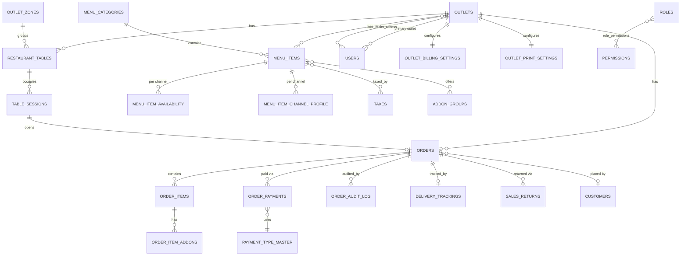

# 05 — Database Schema Design

**Doc status:** Draft for Phase 2–3 (Architecture + DB) review
**Owner:** Data Engineering
**Related:** `docs/01-discovery/decision-register.md` (DEC-001..DEC-012, currently blocking sign-off), `db/migrations`, `db/seeds`
**Scope of this doc:** relational schema (PostgreSQL 15+) for the single-outlet-first, multi-outlet-ready POS core, covering table/floor management, ordering/billing, tax, menu + channel availability, payments, reporting-support structures, staff/auth, and sync/ops tooling.

> Every table below is keyed by `outlet_id` from day one (see §7). This is deliberate over-engineering relative to the "single outlet captured so far" evidence, because retrofitting tenant isolation onto a live billing system is far more expensive than carrying an extra UUID column now.

---

## 0. Conventions

- All primary keys are `uuid` generated via `gen_random_uuid()` (pgcrypto/pgcrypto-free `gen_random_uuid()` is native in PG13+). Surrogate integer `bigint identity` sequence columns are avoided for entities that sync across LAN client + cloud (avoids merge collisions); an internal `seq` bigint identity is still kept on high-volume append-only logs purely for cheap ordering, not as a business key.
- All monetary columns are `numeric(12,2)`. No floats anywhere.
- All tables have `created_at timestamptz not null default now()` and `updated_at timestamptz not null default now()` (maintained by a shared `set_updated_at()` trigger) unless noted.
- Soft delete via `deleted_at timestamptz null` on mutable master-data tables (menu, tax, users, tables) so historical orders that reference a since-removed item still resolve. Transactional tables (orders, payments) are never hard- or soft-deleted; corrections go through `order_audit_log` / `sales_returns`.
- Every table that is tenant data carries `outlet_id uuid not null references outlets(id)`.
- Naming: snake_case, singular-domain/plural-table (`menu_items`, not `menu_item`). FK columns are `<referenced_table_singular>_id`.
- Enum-like columns that are **structural** (fixed code paths) use Postgres `enum` types or `check` constraints. Enum-like columns that are **business/tenant content** (payment types, taxes, roles-as-configured-permission-sets) are tables per the no-hardcode rule — see §8.

---

## 1. Tenancy & Outlet

### `outlets`
Purpose: one row per physical restaurant location (tenant boundary for everything else).

| column | type | null | default | notes |
|---|---|---|---|---|
| id | uuid | no | gen_random_uuid() | PK |
| name | text | no | | e.g. "Hotel kapila" |
| legal_name | text | yes | | for invoicing |
| gstin | text | yes | | |
| address_line1 / address_line2 / city / state / pincode | text | yes | | |
| phone | text | yes | | |
| timezone | text | no | 'Asia/Kolkata' | |
| currency_code | char(3) | no | 'INR' | |
| main_server_ip | inet | yes | | matches "Check Machine" screen — LAN server address |
| status | outlet_status_enum | no | 'active' | enum: active, suspended, onboarding |
| created_at / updated_at | timestamptz | no | now() | |

Indexes: PK; `unique (gstin) where gstin is not null`.

### `outlet_zones`
Purpose: table-grouping zones seen on Table View ("AC" / "Non-AC").

| column | type | null | default | notes |
|---|---|---|---|---|
| id | uuid | no | gen_random_uuid() | PK |
| outlet_id | uuid | no | | FK → outlets |
| name | text | no | | "AC", "Non-AC", "Rooftop" — tenant-defined, not enum |
| sort_order | int | no | 0 | |
| deleted_at | timestamptz | yes | null | |

Indexes: `(outlet_id)`; `unique (outlet_id, name) where deleted_at is null`.

---

## 2. Tables & Sessions

### `restaurant_tables`
Purpose: physical/virtual dine-in tables shown on Table/Floor view.

| column | type | null | default | notes |
|---|---|---|---|---|
| id | uuid | no | gen_random_uuid() | PK |
| outlet_id | uuid | no | | FK → outlets |
| zone_id | uuid | no | | FK → outlet_zones |
| label | text | no | | "T1", "12" |
| capacity | smallint | yes | | seats |
| sort_order | int | no | 0 | for floor layout ordering |
| deleted_at | timestamptz | yes | null | |

Indexes: `(outlet_id)`; `(zone_id)`; `unique (outlet_id, label) where deleted_at is null`.

### `table_sessions`
Purpose: one row per occupancy of a table — drives the color-coded status (blank/running/printed/paid/running-kot) and elapsed-time/running-amount display without polling `orders` directly.

| column | type | null | default | notes |
|---|---|---|---|---|
| id | uuid | no | gen_random_uuid() | PK |
| outlet_id | uuid | no | | FK → outlets |
| table_id | uuid | no | | FK → restaurant_tables |
| order_id | uuid | yes | | FK → orders, set once an order is opened against the table |
| status | table_session_status_enum | no | 'blank' | enum: blank, running, kot_printed, bill_printed, paid — structural, tied to floor-view rendering logic |
| opened_at | timestamptz | no | now() | |
| closed_at | timestamptz | yes | null | |
| pax | smallint | yes | | |

Indexes: `(outlet_id, status)` (floor view filters by open sessions); `(table_id)`; partial `unique (table_id) where closed_at is null` — enforces one active session per table.

---

## 3. Staff, Auth, Roles & Permissions

Implied by the "Logout" nav item and by `actor_id` needed on every audit row. Roles/permissions are **structural** (they gate code paths) so the *keys* are an enum/constant set, but the **assignment of which permission-keys make up a role**, and **which users hold which role at which outlet**, is tenant data → tables, per the no-hardcode rule.

### `users`
| column | type | null | default | notes |
|---|---|---|---|---|
| id | uuid | no | gen_random_uuid() | PK |
| outlet_id | uuid | no | | primary outlet; multi-outlet access via `user_outlet_access` |
| full_name | text | no | | |
| phone | text | yes | | login can be phone+PIN, common in POS terminals |
| username | text | yes | | |
| password_hash | text | yes | | nullable if PIN-only login |
| pin_hash | text | yes | | 4–6 digit quick login |
| status | user_status_enum | no | 'active' | enum: active, disabled |
| last_login_at | timestamptz | yes | | |
| deleted_at | timestamptz | yes | null | |

Indexes: `(outlet_id)`; `unique (username) where deleted_at is null`; `unique (phone) where deleted_at is null`.

### `roles`
Purpose: tenant-definable role names ("Cashier", "Manager", "Kitchen Staff") — not hardcoded, since KapMeta-style tenants customize titles.

| id uuid PK | outlet_id uuid FK | name text not null | is_system boolean default false | deleted_at |

Indexes: `unique (outlet_id, name) where deleted_at is null`.

### `permissions`
Purpose: **structural** — fixed catalog of permission keys tied to actual code paths (e.g. `order.discount.apply`, `bill.grand_total.edit`, `order.void`, `report.item_report.view`). Exempt from no-hardcode rule per CLAUDE.md ("permission keys tied to code paths" are explicitly listed as exempt) — seeded once via migration, not editable in UI.

| key text PK | description text | category text |

### `role_permissions`
Purpose: the tenant-editable mapping of role → permission (this mapping itself IS business data even though `permissions` rows are structural).

| role_id uuid FK → roles | permission_key text FK → permissions(key) | — composite PK (role_id, permission_key) |

### `user_outlet_access`
Purpose: supports multi-outlet staff (e.g. area manager) — see §7.

| user_id uuid FK | outlet_id uuid FK | role_id uuid FK | composite PK (user_id, outlet_id) |

---

## 4. Menu, Categories, Addons, Channel Availability

Confirmed screens: category rail + item grid, Menu Online-Availability Manager (Item/Addon On-Off per channel Swiggy/Zomato), Mark Out-of-Stock modal (allow-alternate, propagate-to-all-platforms), Online Display Name distinct from POS name.

### `sales_channels`
Purpose: **structural enum-ish but kept as a table** because new aggregators get onboarded over time without a code deploy (e.g. adding "Magicpin"); a fixed `check` enum would violate exactly the kind of change this system needs to support without redeploys, and the CLAUDE.md example list explicitly calls out "tenant-configurable" content as needing tables.

| code text PK | e.g. 'pos', 'swiggy', 'zomato' |
| display_name text |
| is_pos boolean default false | true only for 'pos' — used to distinguish in-house channel |

### `menu_categories`
| id uuid PK | outlet_id uuid FK | name text not null | sort_order int default 0 | deleted_at |

Indexes: `(outlet_id, sort_order)`.

### `menu_items`
Purpose: master item, POS-facing.

| column | type | null | default | notes |
|---|---|---|---|---|
| id | uuid | no | gen_random_uuid() | PK |
| outlet_id | uuid | no | | |
| category_id | uuid | no | | FK → menu_categories |
| pos_name | text | no | | name shown on POS |
| sku_code | text | yes | | "Code" column from Item Report |
| base_price | numeric(12,2) | no | | |
| is_active | boolean | no | true | master on/off, distinct from per-channel availability |
| track_stock | boolean | no | false | |
| deleted_at | timestamptz | yes | null | |

Indexes: `(outlet_id, category_id)`; `unique (outlet_id, sku_code) where sku_code is not null and deleted_at is null`; trigram index `(pos_name)` for POS search-as-you-type.

### `menu_item_channel_profile`
Purpose: the "Online Display Name" is a distinct string per channel from POS name — one row per (item, channel).

| item_id uuid FK | channel_code text FK → sales_channels | display_name text | is_visible boolean default true | composite PK (item_id, channel_code) |

### `menu_item_availability`
Purpose: drives the Mark Out-of-Stock modal — per item, per channel, with alternate-allowed and propagate flags. Kept separate from `menu_item_channel_profile` because availability toggles far more frequently (multiple times a shift) than display metadata, and needs its own audit trail (`changed_by`, `changed_at`) without bloating the profile table.

| column | type | null | default | notes |
|---|---|---|---|---|
| item_id | uuid | no | | FK → menu_items |
| channel_code | text | no | | FK → sales_channels |
| is_available | boolean | no | true | |
| allow_alternate | boolean | no | false | "toggle allow-alternate" from OOS modal |
| oos_reason | text | yes | | |
| marked_out_at | timestamptz | yes | | |
| marked_by | uuid | yes | | FK → users |
| auto_revert_at | timestamptz | yes | | many POS systems support "back tomorrow" auto re-enable |

PK: `(item_id, channel_code)`. Index `(channel_code, is_available)` for channel-side bulk queries.

### `addons` / `addon_groups` / `menu_item_addon_groups`
Purpose: modifier support ("Addon On/Off" seen on the availability manager implies addons exist as first-class entities, not just item flags).

- `addon_groups`: id, outlet_id, name (e.g. "Toppings"), selection_type (`single`/`multi` — structural enum), min_select, max_select, deleted_at.
- `addons`: id, outlet_id, addon_group_id FK, name, price numeric(12,2), is_active boolean, deleted_at.
- `menu_item_addon_groups`: item_id FK, addon_group_id FK, is_required boolean — composite PK, links items to applicable addon groups.
- `addon_channel_availability`: mirrors `menu_item_availability` shape — (addon_id, channel_code) PK, is_available, propagate flags — since "Addon On/Off" is explicitly a separate toggle from item on/off per the screenshots.

---

## 5. Tax

### `taxes`
Purpose: tenant-defined tax master. Confirmed distinct behavior: dine-in uses **Backward** tax (CGST+SGST 2.5%+2.5%), online orders use a **separate Forward** tax (CGST[Online]+SGST[Online] 2.5%+2.5%) — same nominal rate, different calc mode and different row, so channel_scope + calc_mode both matter and must not be conflated into one flag.

| column | type | null | default | notes |
|---|---|---|---|---|
| id | uuid | no | gen_random_uuid() | PK |
| outlet_id | uuid | no | | |
| title | text | no | | "CGST", "SGST", "CGST[Online]" |
| tax_type | tax_direction_enum | no | | enum: backward, forward — structural, defines calc algorithm |
| calc_type | tax_calc_type_enum | no | 'percentage' | enum: percentage, flat — structural |
| amount | numeric(6,3) | no | | e.g. 2.500 |
| channel_scope | text[] | no | '{pos}' | array of `sales_channels.code`; a tax row applies to listed channels only |
| applies_before_discount | boolean | no | true | mirrors Billing Config's tax-before/after-discount toggle default |
| is_active | boolean | no | true | |
| deleted_at | timestamptz | yes | null | |

Indexes: `(outlet_id, is_active)`; GIN on `channel_scope`.

### `menu_item_taxes`
Purpose: many-to-many, since not all items necessarily share the outlet's default tax set (e.g. packaged goods vs prepared food).

| item_id uuid FK | tax_id uuid FK | composite PK |

---

## 6. Orders, Billing, Payments

### `orders`
Purpose: header row for every order regardless of channel/type.

| column | type | null | default | notes |
|---|---|---|---|---|
| id | uuid | no | gen_random_uuid() | PK |
| outlet_id | uuid | no | | |
| order_no | bigint | no | | per-outlet sequential display number ("Bill No" — reset via Restaurant Config "Reset Bill No." tile) |
| kot_no | bigint | yes | | |
| channel_code | text | no | | FK → sales_channels |
| order_type | order_type_enum | no | | enum: dine_in, pickup, delivery, advance — structural, drives routing/pricing logic |
| table_session_id | uuid | yes | | FK → table_sessions, dine-in only |
| customer_id | uuid | yes | | FK → customers |
| status | order_status_enum | no | 'open' | enum: open, kot_printed, billed, paid, cancelled, refunded — structural |
| item_total | numeric(12,2) | no | 0 | sum of order_items before tax/charges — the "Total" concept |
| tax_total | numeric(12,2) | no | 0 | |
| discount_total | numeric(12,2) | no | 0 | |
| delivery_charge | numeric(12,2) | no | 0 | |
| container_charge | numeric(12,2) | no | 0 | |
| service_charge | numeric(12,2) | no | 0 | |
| my_amount | numeric(12,2) | no | 0 | outlet's net receivable — see open question in §11 (My Amount vs Grand Total) |
| grand_total | numeric(12,2) | no | 0 | customer-facing final payable, editable via pencil icon → always mediated through order_audit_log |
| aggregator_order_ref | text | yes | | Swiggy/Zomato order id |
| aggregator_otp | text | yes | | OTP shown on live feed |
| rider_status | text | yes | | free text/enum TBD pending rider domain, see `delivery_trackings` |
| placed_at | timestamptz | no | now() | |
| kot_printed_at / bill_printed_at / paid_at / cancelled_at | timestamptz | yes | | |
| created_by / cancelled_by | uuid | yes | | FK → users |
| deleted_at | timestamptz | yes | null | never physically deleted; retained field for consistency, expected always null |

Indexes:
- `unique (outlet_id, order_no)`
- `(outlet_id, status, created_at)` — primary index for Order History / Current Order list filtering
- `(outlet_id, created_at)` — Day-End summary and Item Report date-range scans
- `(outlet_id, channel_code, created_at)` — per-channel reporting
- `(table_session_id)`

### `order_items`
| column | type | null | default | notes |
|---|---|---|---|---|
| id | uuid | no | gen_random_uuid() | PK |
| order_id | uuid | no | | FK → orders |
| item_id | uuid | no | | FK → menu_items (never cascaded-deleted — snapshot fields below protect history) |
| item_name_snapshot | text | no | | captured at order time so later renames don't rewrite history |
| qty | numeric(8,2) | no | 1 | numeric to support fractional/weighted items |
| unit_price_snapshot | numeric(12,2) | no | | |
| line_total | numeric(12,2) | no | | qty * unit_price - line_discount |
| line_discount | numeric(12,2) | no | 0 | |
| status | order_item_status_enum | no | 'active' | enum: active, cancelled — supports "deleted items handling" print toggle |
| kot_batch_no | int | yes | | supports "only-modified KOT" reprints |
| created_at | timestamptz | no | now() | |

Indexes: `(order_id)`; `(item_id)` (for Item Report joins).

### `order_item_addons`
| order_item_id uuid FK | addon_id uuid FK | qty numeric(6,2) default 1 | unit_price_snapshot numeric(12,2) | composite PK (order_item_id, addon_id) |

### `payment_type_master`
Purpose: tenant-configurable payment types. Confirmed evidence: Day-End summary shows "Other(custom label e.g. Room Service)" — proves payment types are NOT a fixed enum. Per CLAUDE.md this is exactly the class of data that must be a table with a seed/admin-UI path, not a hardcoded list.

| column | type | null | default | notes |
|---|---|---|---|---|
| id | uuid | no | gen_random_uuid() | PK |
| outlet_id | uuid | no | | |
| label | text | no | | "Cash", "Card", "UPI", "Room Service" |
| system_kind | payment_system_kind_enum | no | 'other' | enum: cash, card, upi, online_channel, due, complimentary, other — structural, used for reconciliation logic bucketing even though label is free text |
| is_active | boolean | no | true | |
| sort_order | int | no | 0 | |
| deleted_at | timestamptz | yes | null | |

Indexes: `unique (outlet_id, label) where deleted_at is null`.

### `order_payments`
| column | type | null | default | notes |
|---|---|---|---|---|
| id | uuid | no | gen_random_uuid() | PK |
| order_id | uuid | no | | FK → orders |
| payment_type_id | uuid | no | | FK → payment_type_master |
| amount | numeric(12,2) | no | | |
| is_due | boolean | no | false | supports "Due Payment" row on Day Summary |
| reference_no | text | yes | | card/UPI ref |
| collected_by | uuid | yes | | FK → users |
| collected_at | timestamptz | no | now() | |

Indexes: `(order_id)`; `(payment_type_id, collected_at)` — feeds Day-End Payment-Type Summary directly.

### `order_audit_log`
Purpose: append-only trail for every manual edit, specifically grand_total pencil-icon edits, discounts, cancellations — "must be audited" per confirmed feature #6.

| column | type | null | default | notes |
|---|---|---|---|---|
| seq | bigint identity | no | | ordering only, not a business key |
| id | uuid | no | gen_random_uuid() | PK |
| order_id | uuid | no | | FK → orders |
| actor_id | uuid | yes | | FK → users, null for system actions |
| action | text | no | | e.g. 'grand_total_edit', 'item_cancel', 'discount_apply', 'kot_reprint' |
| field_name | text | yes | | |
| old_value | text | yes | | stored as text for heterogeneity across action types |
| new_value | text | yes | | |
| reason | text | yes | | |
| created_at | timestamptz | no | now() | |

Indexes: `(order_id, created_at)`; `(actor_id, created_at)`.

### `sales_returns`
Purpose: supports Day-End "Sales Return Orders" section. **Field list is provisional** — screenshot was cut off (see §11 open questions); modeled conservatively as a reversal linked to the original order.

| column | type | null | default | notes |
|---|---|---|---|---|
| id | uuid | no | gen_random_uuid() | PK |
| outlet_id | uuid | no | | |
| original_order_id | uuid | no | | FK → orders |
| return_amount | numeric(12,2) | no | | |
| reason | text | yes | | |
| processed_by | uuid | yes | | FK → users |
| created_at | timestamptz | no | now() | |

Indexes: `(outlet_id, created_at)`; `(original_order_id)`. **Flagged for revision** once full field list is confirmed (partial-item vs whole-order returns, refund-method linkage to `order_payments`).

### `customers`
Purpose: order ticket panel captures mobile/name/address/locality; needed for repeat-customer lookup and delivery.

| id uuid PK | outlet_id uuid FK | phone text | name text | address text | locality text | created_at |

Indexes: `unique (outlet_id, phone) where phone is not null`.

### `delivery_trackings`
Purpose: rider status, "Prepare In" SLA countdown on the Online Order Live Feed.

| column | type | null | default | notes |
|---|---|---|---|---|
| id uuid PK | order_id uuid FK unique | rider_name text | rider_phone text | status text | -- open question: enum vs free text, aggregator-dependent, see §11 |
| prepare_by | timestamptz | yes | | drives SLA countdown |
| assigned_at / picked_up_at / delivered_at | timestamptz | yes | | |

---

## 7. Outlet Configuration Tables

### `outlet_billing_settings`
Purpose: one row per outlet — default order/payment type, charge modes, discount basis.

| column | type | null | default | notes |
|---|---|---|---|---|
| outlet_id | uuid | no | | PK, FK → outlets |
| default_order_type | order_type_enum | no | 'dine_in' | |
| default_payment_type_id | uuid | yes | | FK → payment_type_master |
| default_table_id | uuid | yes | | FK → restaurant_tables |
| container_charge_mode | charge_mode_enum | no | 'order_wise' | enum: item_wise, order_wise, fix_per_item — structural |
| container_charge_amount | numeric(12,2) | no | 0 | |
| container_charge_channels | text[] | no | '{}' | which channels auto-apply it (delivery/pickup/dine_in) |
| service_charge_percent | numeric(5,2) | no | 0 | |
| tax_applies_before_discount | boolean | no | true | |
| discount_calc_basis | discount_basis_enum | no | 'total' | enum: total, core — structural |
| updated_at | timestamptz | no | now() | |

### `outlet_print_settings`
Purpose: the ~13 KOT/bill print toggles plus Bill Print Settings block.

| column | type | null | default | notes |
|---|---|---|---|---|
| outlet_id | uuid | no | | PK, FK → outlets |
| print_kot_on_bill | boolean | no | false | |
| print_only_modified_kot | boolean | no | true | |
| show_deleted_items_on_kot | boolean | no | false | |
| print_cancelled_kot | boolean | no | false | |
| bifurcate_cwt_tax | boolean | no | false | CWT tax bifurcation toggle |
| show_backward_tax | boolean | no | true | |
| mark_duplicate_print | boolean | no | true | |
| highlight_order_id | boolean | no | false | |
| restaurant_display_name | text | yes | | |
| header_text | text | yes | | |
| footer_text | text | yes | | |
| new_customer_message | text | yes | | |
| show_gstin_on_bill | boolean | no | true | |
| show_item_hsn_on_bill | boolean | no | false | |
| updated_at | timestamptz | no | now() | |

> Remaining print toggles beyond the confirmed ~13 are added as columns during Phase 3 detailed design once the full config screen is re-captured; this table intentionally uses discrete boolean columns rather than a JSONB blob so each toggle stays independently indexable/queryable and self-documenting — a deliberate departure from "just JSONB it," worth flagging: if the real screen has >30 toggles, revisit as a `outlet_print_setting_values(outlet_id, setting_key, value)` EAV table instead, still DB-backed either way, not hardcoded in app code.

### `print_templates`
Purpose: implied by bill/KOT print configuration needing an actual renderable template, not just toggles.

| id uuid PK | outlet_id uuid FK | template_type text ('kot','bill') | body text (template markup) | is_default boolean | deleted_at |

---

## 8. Why tables, not enums/hardcoded literals

Per CLAUDE.md's no-hardcode rule, the following are explicitly modeled as tables with seed/admin-UI paths rather than code constants, with the evidence that forced the decision:

- **`payment_type_master`** — the Day-End Summary showed a custom label ("Room Service") sitting alongside standard types. If payment types were a code enum, onboarding any tenant with a non-standard payment method (hotel room-charge, wallet, loyalty points) would require a deploy. Table + `system_kind` enum gives reconciliation logic a stable bucket while the label itself stays tenant-editable via an admin form.
- **`menu_categories` / `menu_items` / `addons` / `addon_groups`** — explicitly called out in the task itself as tenant-configured, not hardcoded; category rail and item grid are populated per-outlet.
- **`taxes`** — tax titles, rates, and channel scope vary by tenant/jurisdiction and change over time (e.g., GST rate revisions); `tax_type`/`calc_type` stay structural enums because they select an *algorithm* in code, but the rate/title/scope are data.
- **`sales_channels`** — new aggregators onboard without code changes.
- **`roles` / `role_permissions`** — role *names* and which permissions compose them are tenant-editable; `permissions.key` stays a structural, code-tied catalog (explicitly exempted by CLAUDE.md).
- **`outlet_billing_settings` / `outlet_print_settings`** — entire premise of these tables is "config that changes per tenant," directly named in the rule's own examples.

Anything seeded for the demo tenant ("Hotel kapila") goes through `db/seeds`, which is itself migration-path data insertion — sanctioned by rule clause 1, not an exception to it (see §9).

---

## 9. Migration & Seed Strategy

**Tooling assumption:** `node-pg-migrate` or Prisma Migrate (final choice is a Phase-3 tooling decision, DEC-xxx pending) — this doc assumes a plain timestamp-prefixed SQL migration convention compatible with either.

**Naming convention:** `db/migrations/<YYYYMMDDHHMMSS>__<snake_case_description>.sql`, e.g. `20260821093000__create_outlets_and_zones.sql`. Each migration ships paired `up`/`down`:

```
db/migrations/
  20260821093000__create_outlets_and_zones.up.sql
  20260821093000__create_outlets_and_zones.down.sql
  20260821093500__create_restaurant_tables.up.sql
  ...
```

**Ordering/grouping:** migrations are grouped by dependency layer — (1) `outlets`/`users`/`roles`/`permissions`, (2) `menu_*`/`taxes`/`sales_channels`, (3) `restaurant_tables`/`table_sessions`, (4) `orders`/`order_items`/`order_payments`/`order_audit_log`, (5) config tables, (6) `sync_state`/`backup_jobs`. Each layer only references earlier layers, so migrations can be replayed strictly in filename order with no forward-references.

**Down migrations:** required for every up migration during active development (pre-prod); post-launch, destructive `down`s on tables holding order history are replaced with a documented manual rollback runbook rather than an automated `DROP` — irreversible data loss should never be one command away in production.

**Seed data (sanctioned no-hardcode path):** `db/seeds/` contains idempotent SQL/TS seed scripts, run only in dev/staging/demo environments, never against a real tenant's prod outlet:

```
db/seeds/
  001_demo_outlet_hotel_kapila.sql       -- inserts into outlets, outlet_zones
  002_demo_roles_permissions.sql
  003_demo_menu_hotel_kapila.sql          -- categories/items/addons for the demo tenant
  004_demo_tax_master.sql                 -- CGST/SGST 2.5%+2.5% backward + forward[online] rows
  005_demo_payment_types.sql              -- Cash/Card/UPI/Room Service
  006_demo_tables_and_zones.sql
```

Each seed script is `insert ... on conflict do nothing` against a natural key (e.g. `(outlet_id, name)`) so it's safe to re-run. This satisfies the rule: the "Hotel kapila" sample data lives entirely in `db/seeds`, loaded through the same migration runner, never as literals in `apps/*` or `services/*` source.

**Environment gating:** seed scripts are namespaced under a `is_demo boolean default false` column on `outlets`; application code can filter/warn on demo tenants, and a CI check fails the build if any `is_demo = true` outlet_id literal appears outside `db/seeds/**`.

---

## 10. Indexing, Reporting & Performance Notes

**OLTP-side indexes** are listed inline per table above. Highlights specific to reporting workloads:

- `orders (outlet_id, created_at)` and `orders (outlet_id, status, created_at)` are the two indexes that carry almost all reporting query load (Day-End Summary, Order History, date-range filters). Both are `btree`, and `created_at` should be stored/queried in the outlet's local day boundaries (use `outlets.timezone` in the query layer, not UTC day-cutoffs, since a "day" in POS terms is a business day that may run past midnight).
- `order_items (item_id)` combined with `orders (outlet_id, created_at)` via join supports the **Item Report** (sales grouped by category, qty/total, sub-totals). Given item report is a heavy aggregate scan over a join, this is the strongest candidate for a **materialized view**:

```sql
create materialized view mv_item_sales_daily as
select
  oi.item_id,
  o.outlet_id,
  date_trunc('day', o.created_at at time zone ot.timezone) as business_date,
  sum(oi.qty) as qty_sold,
  sum(oi.line_total) as total_sales
from order_items oi
join orders o on o.id = oi.order_id
join outlets ot on ot.id = o.outlet_id
where oi.status = 'active' and o.status in ('billed','paid')
group by oi.item_id, o.outlet_id, business_date;

create unique index on mv_item_sales_daily (outlet_id, item_id, business_date);
```

Refreshed via `REFRESH MATERIALIZED VIEW CONCURRENTLY mv_item_sales_daily` on a schedule (e.g. every 5–10 min during business hours, plus an on-demand refresh trigger at day-close) rather than computed live, since Item Report is read-heavy and tolerant of a few minutes' staleness — unlike Table View / Live Feed which must be real-time and therefore stay off materialized views entirely.

- **Day-End Payment-Type Summary** is served directly from `order_payments` joined to `payment_type_master`, indexed on `(payment_type_id, collected_at)`; volume per outlet per day is low enough (hundreds, not millions, of rows) that a live aggregate query is fine — no materialized view needed here, avoid over-engineering.
- **Read replica:** recommended once outlet count grows past single digits or when the admin-web reporting surface (multi-outlet rollups, corporate dashboards) is built — point reporting/BI queries at a streaming replica so they never contend with the LAN POS terminal's OLTP writes. Not needed for the single-outlet Phase 2 milestone; call out as a Phase 4+ infra item.
- **Partitioning:** `orders`, `order_items`, `order_payments`, and `order_audit_log` are strong candidates for range partitioning by month once historical volume grows (each POS outlet can generate tens of thousands of orders/month at scale). Recommend declaring `orders` as `partition by range (created_at)` from the start (even with a single initial partition) so partition rollover is a lever, not a future migration — same for `order_audit_log`, which grows fastest.
- **GIN indexes:** `taxes.channel_scope` (array containment lookups per channel at order-tax-calc time).
- **Trigram (`pg_trgm`) index** on `menu_items.pos_name` for POS-terminal item search-as-you-type (large item catalogs, fast fuzzy match).

---

## 11. ERD (textual + Mermaid)

Key relationships:

- `outlets` 1—N everything (tenant root).
- `outlet_zones` 1—N `restaurant_tables` 1—N `table_sessions` N—1 `orders`.
- `menu_categories` 1—N `menu_items` N—N `taxes` (via `menu_item_taxes`); `menu_items` 1—N `menu_item_availability`/`menu_item_channel_profile` (per `sales_channels`).
- `menu_items` N—N `addon_groups` (via `menu_item_addon_groups`) 1—N `addons`.
- `orders` 1—N `order_items` 1—N `order_item_addons`; `orders` 1—N `order_payments` N—1 `payment_type_master`; `orders` 1—N `order_audit_log`; `orders` 1—1 `delivery_trackings` (nullable, delivery only); `orders` 1—N `sales_returns` (as `original_order_id`).
- `users` N—N `outlets` via `user_outlet_access`, each pairing carrying a `role_id`; `roles` N—N `permissions` via `role_permissions`.



---

## 12. Multi-Outlet Readiness & Isolation

Only one outlet ("Hotel kapila") has been observed, but the LAN client-server topology (Main Server IP vs Client Machine IP on the Check Machine screen) confirms an architecture built to run one local DB per outlet that syncs to a cloud store — so multi-outlet is a near-certain roadmap item even before it's contractually confirmed. Design choices made now to keep that cheap later:

- **Every business table carries `outlet_id`** (already reflected above), enforced via `not null` + FK, never inferred transitively through joins — this makes row-level security trivial to bolt on later:

```sql
alter table orders enable row level security;
create policy outlet_isolation on orders
  using (outlet_id = current_setting('app.current_outlet_id')::uuid);
```

  Same policy pattern applies to every tenant table once the API layer sets `app.current_outlet_id` per session/request. Not enabled from day one (adds overhead not needed for single-outlet Phase 2) but every table is already shaped for it — this is the isolation mechanism recommended once multi-outlet lands, versus schema-per-tenant or DB-per-tenant, because it keeps cross-outlet corporate reporting (item report rollups across a chain) a single query rather than a fan-out.
- **Local-first sync model** (see §13 `sync_state`): each outlet's on-prem server is the write-of-record for that outlet's own rows during a LAN session; cloud is eventually-consistent. `outlet_id` as a partition key also means sync conflict resolution never has to reconcile cross-outlet collisions — only intra-outlet ones.
- **`user_outlet_access`** already supports one staff member (e.g. an area manager or the tenant owner) having access to N outlets with a role scoped per outlet, rather than a single global role — this was designed in from §3 specifically anticipating multi-outlet, not retrofitted.
- **Sequence scoping:** `orders.order_no` is `unique(outlet_id, order_no)`, not globally unique — each outlet's bill numbering is independent (matches the "Reset Bill No." tile being a per-outlet action in Restaurant Configuration).

---

## 13. Sync & Ops Support Tables

Confirmed evidence: Restaurant/System Configuration tiles — Reset Sync Code, Database Migration, Remove All Orders/KOT, Remove Backup Files, Logs, Check Machine.

### `sync_state`
Purpose: tracks LAN-server ↔ cloud sync checkpoint per outlet per table (or per logical sync-group), supports "Reset Sync Code" tile.

| column | type | null | default | notes |
|---|---|---|---|---|
| id | uuid | no | gen_random_uuid() | PK |
| outlet_id | uuid | no | | |
| sync_code | text | no | | rotatable token, regenerated by "Reset Sync Code" |
| entity_name | text | no | | e.g. 'orders', 'menu_items' — which logical stream |
| last_synced_at | timestamptz | yes | | |
| last_synced_cursor | text | yes | | opaque high-watermark (timestamp or sequence) |
| status | sync_status_enum | no | 'idle' | enum: idle, syncing, error |
| last_error | text | yes | | |

Indexes: `unique (outlet_id, entity_name)`.

### `backup_jobs`
Purpose: supports "Remove Backup Files" / general local backup lifecycle visible in System Configuration.

| id uuid PK | outlet_id uuid FK | file_path text | size_bytes bigint | status text ('pending','completed','failed','purged') | created_at | purged_at timestamptz null |

### `system_logs`
Purpose: backs the "Logs" tile — kept as a lightweight table (or, at scale, redirected to an external log store with only a pointer table here); modeled minimally since detailed logging infra is a separate Phase 4 concern.

| id bigint identity PK | outlet_id uuid FK | level text | source text | message text | context jsonb | created_at timestamptz default now() |

Index: `(outlet_id, created_at)`; consider converting to a partitioned/TTL'd table or shipping to external log infra (this is intentionally the one place a `jsonb` free-form column is acceptable — it's operational/diagnostic data, not business data, so it doesn't trigger the no-hardcode rule).

---

## 14. Open Schema Questions (mapped to flagged ambiguities)

These block final sign-off of the affected tables and should route back through `docs/01-discovery/decision-register.md`:

1. **"MFR" button (Live Orders screen)** — meaning unconfirmed. No schema impact assumed yet; if it turns out to mean something like "Mark For Refund" it would likely add a status value to `order_status_enum` and/or a linkage to `sales_returns`. **Action:** do not extend the enum until confirmed — enum values are structural and a wrong guess is an expensive migration to unwind.
2. **`sales_returns` field list** — screenshot cut off; current table is a conservative minimal reversal record (amount + reason). Needs revisiting for: partial vs full-order returns (would need a `sales_return_items` child table), refund method (link to `order_payments` or a new `refund_id`), approval workflow (`approved_by`/`approved_at`), and whether returns can happen against orders that were paid via an online channel (refund flows differ by aggregator).
3. **Icon-only unlabeled buttons** — no direct schema impact identified so far; flagged so that if any turn out to be data-mutating actions (not just navigation), they may need their own `order_audit_log.action` values or dedicated tables.
4. **My Amount vs Grand Total vs item Total** — modeled currently as three distinct columns on `orders` (`item_total`, `my_amount`, `grand_total`) on the conservative assumption they are three distinct money concepts (pre-tax subtotal, outlet-net-receivable after commission/charges, customer-facing final payable). **This is a guess.** If discovery confirms `my_amount` is actually derived (e.g. `grand_total` minus aggregator commission, itself needing a `commission_amount` column) or that two of the three collapse into one, this section of `orders` gets revised — flagged as the single highest-risk assumption in this schema.
5. **Multi-outlet behavior unverified** — schema is built multi-outlet-ready per §12, but no real second-outlet screenshot exists to validate assumptions like whether menu/tax masters are ever shared across outlets in a chain (currently modeled as fully per-outlet, zero sharing) versus a chain-level template that outlets override. If chains turn out to share a corporate menu template, a `menu_item_templates` layer above `menu_items` would need to be introduced — noted as a possible future normalization, not built preemptively (YAGNI until confirmed).
6. **`delivery_trackings.status` and `rider_status`** — stored as free text pending confirmation of the actual state machine per aggregator (Swiggy/Zomato rider states likely differ); left as text rather than enum specifically so it isn't hardcoded against an unconfirmed structural assumption — revisit once aggregator webhook payloads are documented in `contracts/`.
7. **Container/service charge interaction with tax basis** — `outlet_billing_settings` models these as flat settings; unconfirmed whether container/service charges are themselves taxed under `applies_before_discount`/backward-forward tax logic identically to item lines, or use their own tax treatment. Needs a dedicated Billing Config screen re-capture to confirm before the tax-calculation service is implemented against this schema.

---

## 15. Summary of New Tables Beyond the Requested List

Added during design, with rationale already inlined above: `outlet_zones`, `users`, `roles`, `permissions`, `role_permissions`, `user_outlet_access`, `sales_channels`, `menu_item_channel_profile`, `addon_groups`, `addons`, `menu_item_addon_groups`, `addon_channel_availability`, `menu_item_taxes`, `customers`, `delivery_trackings`, `print_templates`, `system_logs`.
