# Complete Logic Flow & Domain Architecture Specification

**Product:** Kapmeta Restaurant POS & Operations Platform  
**Target:** Production Multi-Outlet POS, Kitchen Display System (KDS), Waiter Mobile Station, Online Aggregator Hub, Inventory & Financial Accounting  
**Standard:** Minor Units (paise/cents integer money), Append-Only Audit Trails, Idempotent Processing, Zero Hardcoding

---

## 1. System Overview & Core Entity Architecture

The Kapmeta POS platform operates on an event-driven, multi-tenant restaurant domain model. All financial amounts are stored as integers in minor currency units (`amount_minor`, e.g., 25000 = ₹250.00).

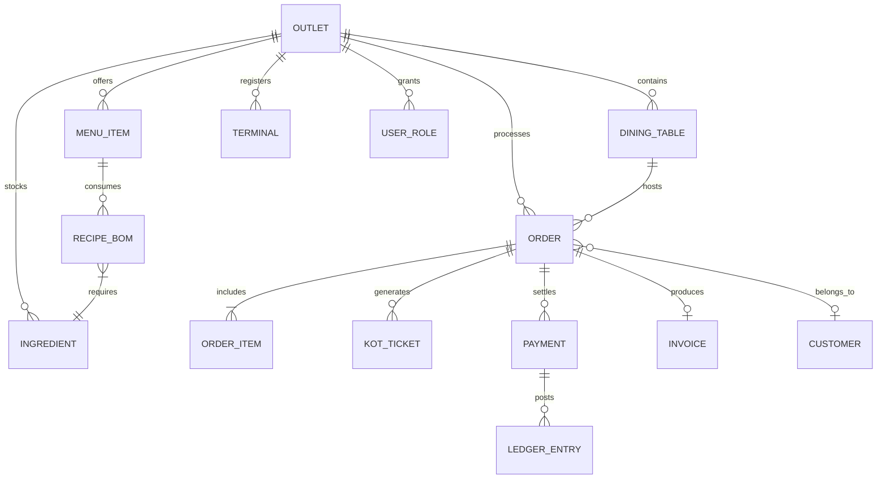

---

## 2. End-to-End Logic Flows

### Flow 1: Authentication, Session & Role-Based Access Control (RBAC)

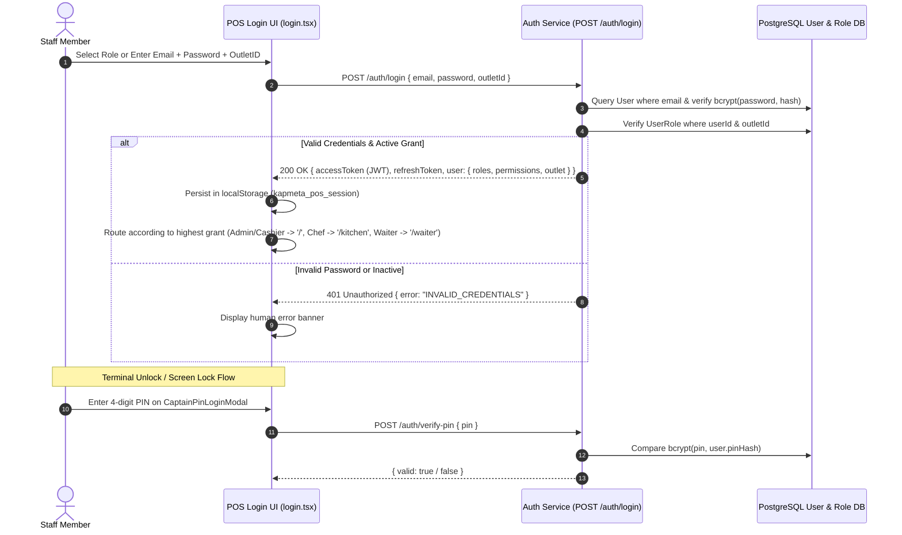

**RBAC Permission Matrix:**
- `SUPER_ADMIN` / `OUTLET_MANAGER`: `order.create`, `order.cancel`, `kot.read`, `kot.update`, `payment.capture`, `refund.issue`, `menu.category.manage`, `inventory.stock.adjust`, `finance.zreport`, `rbac.user.manage`.
- `CASHIER`: `order.create`, `kot.read`, `payment.capture`, `tables.read`, `tables.update`.
- `KITCHEN_USER` / `CHEF`: `kot.read`, `kot.update`, `menu.item.toggle86`.
- `WAITER` / `CAPTAIN`: `order.create`, `tables.read`, `waiters.heartbeat`.

---

### Flow 2: Table Floor Plan & Dine-In Lifecycle

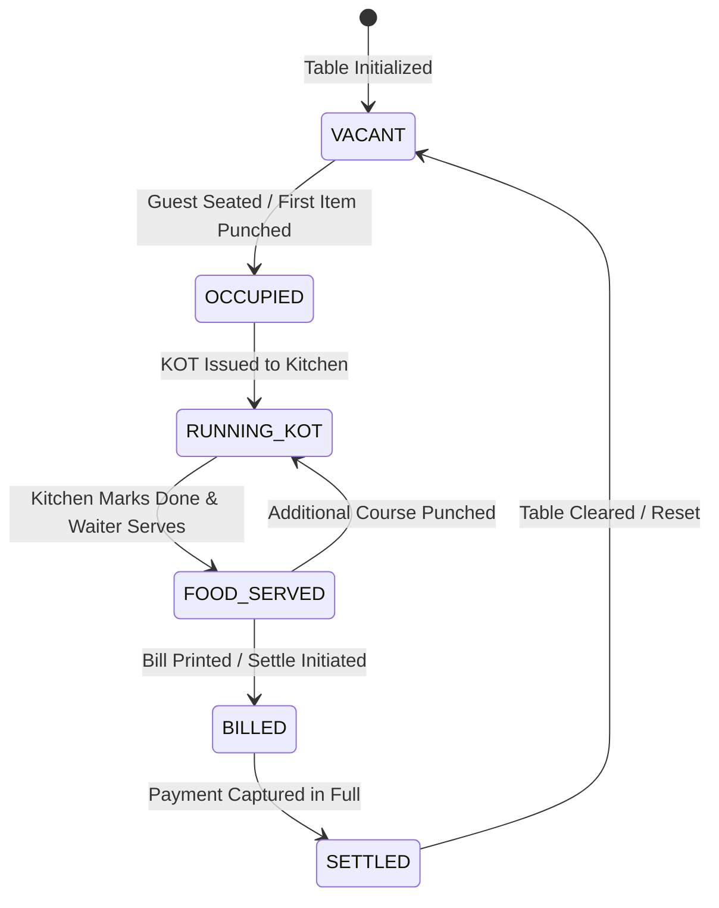

**Table Operations Logic:**
1. **Section Segmentation**: Tables partitioned by sections (`AC`, `Non AC`, `Terrace Lounge`, `Family Section`).
2. **Table Status Indicator Colors**:
   - `VACANT`: `#10b981` (Green)
   - `OCCUPIED`: `#ef4444` (Red)
   - `BILLED`: `#3b82f6` (Blue)
   - `KOT_PLACED`: `#f59e0b` (Amber)
3. **Table Shift / Move**: When moving Table $T_A \rightarrow T_B$:
   - Verifies $T_B$ is `VACANT` (or prompts merge).
   - Atomic transaction updates `orders.dining_table_id` from $T_A$ to $T_B$.
   - Appends status history row and emits `table.moved` socket event.

---

### Flow 3: Order Entry, Modifiers, Discounts & Tax Calculation Algorithm

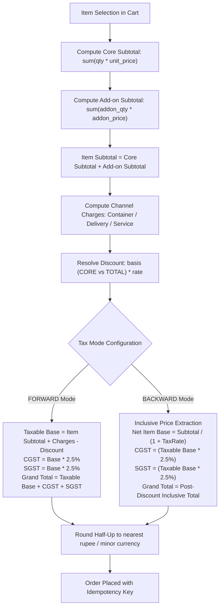

**Formula for Forward Tax Calculation:**
$$\text{Taxable Value} = \text{Item Subtotal} + \text{Charges} - \text{Discount}$$
$$\text{CGST} = \text{round}\left(\text{Taxable Value} \times \frac{r_{\text{CGST}}}{100}\right), \quad \text{SGST} = \text{round}\left(\text{Taxable Value} \times \frac{r_{\text{SGST}}}{100}\right)$$
$$\text{Grand Total} = \text{Taxable Value} + \text{CGST} + \text{SGST}$$

---

### Flow 4: Kitchen Display System (KDS) & Multi-Station Routing

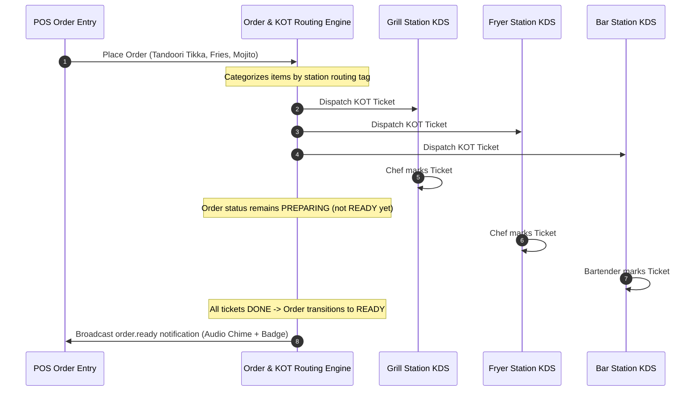

**KDS Guarantees:**
- **Atomic Creation**: Order header and station tickets commit in a single database transaction.
- **Completion Gate**: An order transitions to `READY` if and only if all child station KOT tickets are marked `DONE`.
- **Course Phasing**: `STARTER` tickets display priority badges over `MAIN` and `DESSERT`.

---

### Flow 5: Orders Management, Post-KOT Cancellation & Audit Logs

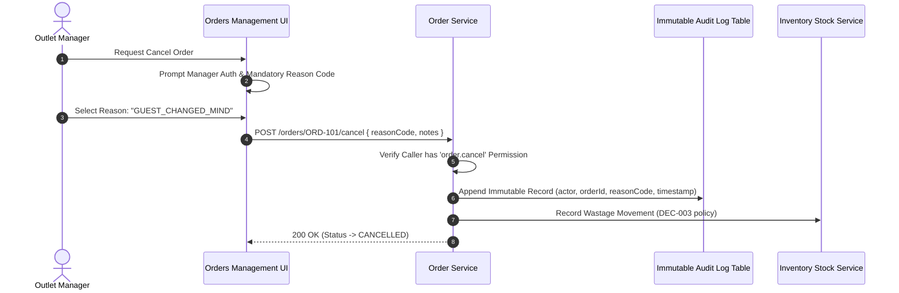

---

### Flow 6: Multi-Tender Payments, Bill Split & Fiscal Invoicing

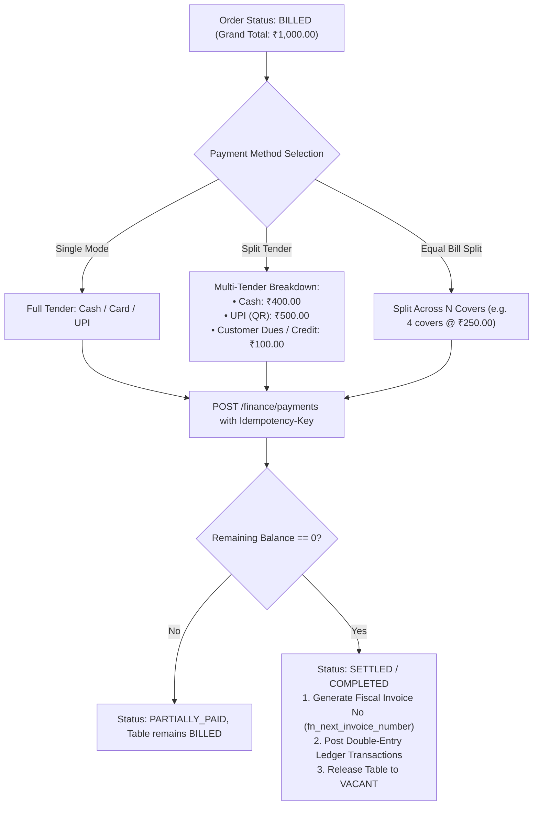

---

### Flow 7: Waiter / Captain Mobile Station

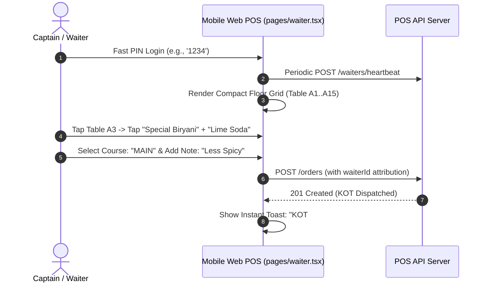

---

### Flow 8: Online Aggregators & Monotonic 86 Item Availability Sync

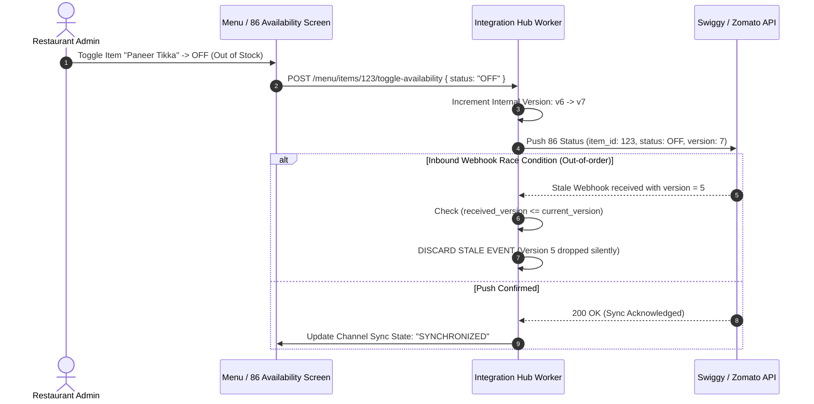

---

### Flow 9: Inventory Recipe Consumption & Stock Shortage

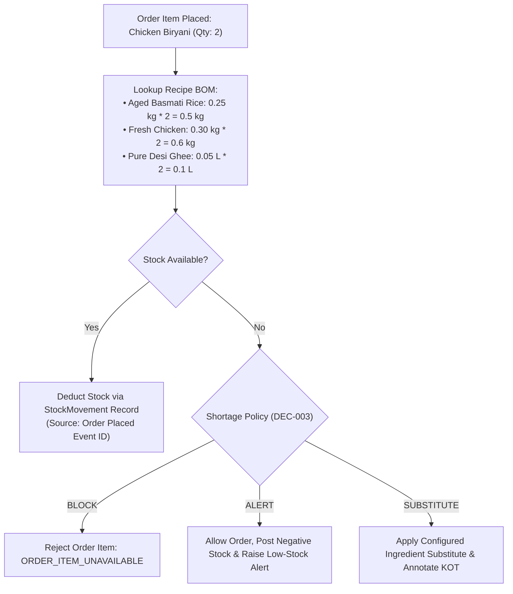

---

### Flow 10: Financial Accounting & Day-End Z-Report Reconciliation

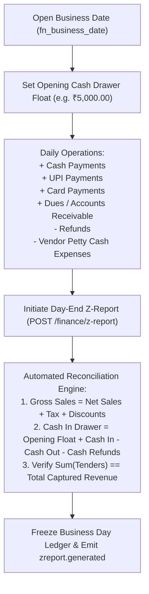

---

## 3. Summary of Core Guarantees & Invariants

1. **Monetary Exactness**: No floats in API payloads or DB schemas; everything is minor units (`amount_minor` integer).
2. **KOT Integrity**: An order cannot be confirmed without its associated KOT tickets, and cannot become `READY` until all stations complete.
3. **Idempotency**: All payment captures and order creation requests require an `Idempotency-Key` header.
4. **Audit Trail**: Cancellations, voids, price overrides, and role changes write append-only records.
5. **Channel Availability Monotonicity**: Aggregator sync version numbers are non-decreasing ($v_{n+1} > v_n$). Stale versions are rejected.
