# Entity Relationship Diagram (ERD) & Database Specification

**ID:** DB-ERD · **Status:** APPROVED · **Version:** 2.0 · **Updated:** 2026-08-09
**Traces to:** `kapmeta/schema.prisma` · `docs/00-governance/phases-of-implementation.md` · `docs/03-architecture/multi-agent-orchestration-and-wiring.md`

---

## 1. Complete System Entity Relationships

```mermaid
erDiagram
    ORGANIZATIONS ||--o{ OUTLETS : "owns"
    OUTLETS ||--o{ DINING_TABLES : "contains"
    OUTLETS ||--o{ TERMINALS : "hosts"
    OUTLETS ||--o{ STATIONS : "monitors"
    OUTLETS ||--o{ USER_ROLES : "scopes"
    OUTLETS ||--o{ SESSIONS : "binds"
    OUTLETS ||--o{ AUDIT_LOGS : "records"
    
    USERS ||--o{ USER_ROLES : "assigned"
    ROLES ||--o{ USER_ROLES : "assigned"
    ROLES ||--o{ ROLE_PERMISSIONS : "contains"
    PERMISSIONS ||--o{ ROLE_PERMISSIONS : "contains"
    USERS ||--o{ SESSIONS : "starts"
    USERS ||--o{ AUDIT_LOGS : "performs"

    OUTLETS ||--o{ MENU_CATEGORIES : "defines"
    MENU_CATEGORIES ||--o{ MENU_ITEMS : "categorizes"
    OUTLETS ||--o{ MODIFIER_GROUPS : "configures"
    MODIFIER_GROUPS ||--o{ MODIFIER_OPTIONS : "contains"
    MENU_ITEMS ||--o{ MENU_ITEM_MODIFIER_GROUPS : "links"
    MODIFIER_GROUPS ||--o{ MENU_ITEM_MODIFIER_GROUPS : "links"
    MENU_ITEMS ||--o{ ITEM_AVAILABILITIES : "tracks_stock"

    OUTLETS ||--o{ ORDERS : "executes"
    DINING_TABLES ||--o{ ORDERS : "seats"
    CUSTOMERS ||--o{ ORDERS : "places"
    ORDERS ||--o{ ORDER_ITEMS : "contains"
    MENU_ITEMS ||--o{ ORDER_ITEMS : "ordered_as"
    ORDER_ITEMS ||--o{ ORDER_ITEM_MODIFIERS : "customized_with"
    MODIFIER_OPTIONS ||--o{ ORDER_ITEM_MODIFIERS : "selected"
    ORDERS ||--o{ ORDER_DISCOUNTS : "applies"
    DISCOUNTS ||--o{ ORDER_DISCOUNTS : "applied_to"
    ORDERS ||--o{ ORDER_STATUS_HISTORY : "progresses"

    ORDERS ||--o{ PAYMENTS : "settled_via"
    PAYMENTS ||--o{ REFUNDS : "refunds"
    ORDERS ||--o{ INVOICES : "billed_as"
    OUTLETS ||--o{ LEDGER_ENTRIES : "posts"

    ORDERS ||--o{ KOT_TICKETS : "dispatches"
    KOT_TICKETS ||--o{ KOT_ITEMS : "contains"
    MENU_ITEMS ||--o{ KOT_ITEMS : "prepared_as"
    KOT_TICKETS ||--o{ KOT_STATUS_HISTORY : "tracks_prep"

    CUSTOMERS ||--o{ LOYALTY_TRANSACTIONS : "earns_redeems"
    ORDERS ||--o{ LOYALTY_TRANSACTIONS : "generates"

    OUTLETS ||--o{ CHANNEL_ACCOUNTS : "integrates"
    CHANNEL_ACCOUNTS ||--o{ CHANNEL_ITEM_MAPPING : "maps_menu"
    CHANNEL_ACCOUNTS ||--o{ CHANNEL_ORDER_MAPPING : "maps_orders"
    CHANNEL_ACCOUNTS ||--o{ INBOUND_EVENTS : "receives"
    CHANNEL_ACCOUNTS ||--o{ OUTBOUND_EVENTS : "sends"

    OUTLETS ||--o{ INGREDIENTS : "stores"
    MENU_ITEMS ||--o{ RECIPES : "composed_of"
    RECIPES ||--o{ RECIPE_INGREDIENTS : "requires"
    INGREDIENTS ||--o{ RECIPE_INGREDIENTS : "used_in"
    INGREDIENTS ||--o{ STOCK_MOVEMENTS : "tracks_units"

    OUTLETS ||--o{ VENDORS : "contracts"
    VENDORS ||--o{ PURCHASE_ORDERS : "supplies"
    PURCHASE_ORDERS ||--o{ PURCHASE_ORDER_ITEMS : "contains"
    INGREDIENTS ||--o{ PURCHASE_ORDER_ITEMS : "procured"
    VENDORS ||--o{ GOODS_RECEIVED_NOTES : "delivers"
    GOODS_RECEIVED_NOTES ||--o{ GOODS_RECEIVED_NOTE_ITEMS : "verifies"
    INGREDIENTS ||--o{ GOODS_RECEIVED_NOTE_ITEMS : "received"
```

---

## 2. Table Groups & Synchronization Status Across Phases

| Table Group | Models Defined | Correlating Phases | Status |
|---|---|---|---|
| **Identity & Security** | `User`, `Role`, `Permission`, `UserRole`, `RolePermission`, `Session`, `AuditLog` | Phase 0, 2, 12 | 🟢 **Fully Synchronized** |
| **Organization Structure** | `Organization`, `Outlet`, `DiningTable`, `Station`, `Terminal`, `BusinessHours` | Phase 0, 2, 5 | 🟢 **Fully Synchronized** |
| **Menu & Catalog** | `MenuCategory`, `MenuItem`, `ModifierGroup`, `ModifierOption`, `MenuItemModifierGroup`, `ItemAvailability` | Phase 1, 4 | 🟢 **Fully Synchronized** |
| **Order Management** | `Order`, `OrderItem`, `OrderItemModifier`, `Discount`, `OrderDiscount`, `OrderStatusHistory` | Phase 2, 5, 10 | 🟢 **Fully Synchronized** |
| **Billing & Finance** | `Payment`, `Invoice`, `Refund`, `LedgerEntry` | Phase 9, 11 | 🟢 **Fully Synchronized** |
| **Kitchen KOT / KDS** | `KOTTicket`, `KOTItem`, `KOTStatusHistory` | Phase 6 | 🟢 **Fully Synchronized** |
| **CRM & Loyalty** | `Customer`, `LoyaltyTransaction` | Phase 10 | 🟢 **Fully Synchronized** |
| **Aggregator Integration**| `ChannelAccount`, `ChannelItemMapping`, `ChannelOrderMapping`, `InboundEvent`, `OutboundEvent`, `SyncJob`, `IntegrationError` | Phase 7 | 🟢 **Fully Synchronized** |
| **Inventory & BOM (R2)** | `Ingredient`, `Recipe`, `RecipeIngredient`, `StockMovement` | Phase 8 | 🟢 **Fully Synchronized** |
| **Vendor Procurement (R2)**| `Vendor`, `PurchaseOrder`, `PurchaseOrderItem`, `GoodsReceivedNote`, `GoodsReceivedNoteItem` | Phase 8 | 🟢 **Fully Synchronized** |

---

## 3. Database Engineering Invariants

1. **Multi-Outlet Tenant Isolation (DEC-001):** Every operational record enforces `outlet_id NOT NULL` with foreign key cascade indices.
2. **Integer Minor Units for Money:** All price, subtotal, tax, discount, unit cost, and invoice amounts are stored in minor units (`BIGINT` paise/cents). Floating-point numeric columns are prohibited for currency.
3. **Append-Only History & Auditability:** Privileged mutations write immutable audit rows (`audit_logs`) and order status changes (`order_status_history`) in the same transaction. Application DB users hold no `UPDATE` or `DELETE` grants on audit tables.
4. **Client-Decoupled UUIDv7 Identifiers:** Orders and line items utilize client-generated UUIDv7 keys to support seamless offline queueing and sync (DEC-002).
