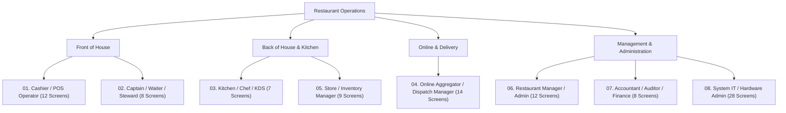

# Role-Wise Screen Inventory & Architecture Directory

**Status:** APPROVED · **Version:** 2.0 · **Target System:** KapMeta POS Desktop & Web Platform · **Total Analyzed Screens:** 90

This document defines the complete separation of all 90 UI screens captured in `Screen_shot` organized by user role, operational responsibility, and system privilege tier.

---

## 1. Role Overview & Distribution

The 90 screenshots captured from the KapMeta POS system are partitioned into **8 operational roles**:

| Role Folder | Role Name | Screen Count | Primary Responsibilities |
|---|---|:---:|---|
| [`01_Cashier_POS_Operator`](file:///c:/Users/BEST%20BUY/Downloads/KapMeta/KapMeta/Screen_shot/By_Role/01_Cashier_POS_Operator) | **Cashier / POS Operator** | **12** | Register billing, dine-in checkout, split bill, cart modifications, cash drawer settlements. |
| [`02_Captain_Waiter_OrderTaking`](file:///c:/Users/BEST%20BUY/Downloads/KapMeta/KapMeta/Screen_shot/By_Role/02_Captain_Waiter_OrderTaking) | **Captain / Waiter / Steward** | **8** | Dine-in table status tracking, order punching, item variations, cooking notes, table transfers. |
| [`03_Kitchen_Chef_KDS`](file:///c:/Users/BEST%20BUY/Downloads/KapMeta/KapMeta/Screen_shot/By_Role/03_Kitchen_Chef_KDS) | **Kitchen Staff / Chef / KDS** | **7** | KOT live view, preparation countdown timers, ticket progression, prep time defaults. |
| [`04_Online_Delivery_Manager`](file:///c:/Users/BEST%20BUY/Downloads/KapMeta/KapMeta/Screen_shot/By_Role/04_Online_Delivery_Manager) | **Online Delivery & Dispatch** | **14** | Swiggy/Zomato live feeds, rider tracking, OTP verification, delay alerts, food-ready updates. |
| [`05_Store_Inventory_Manager`](file:///c:/Users/BEST%20BUY/Downloads/KapMeta/KapMeta/Screen_shot/By_Role/05_Store_Inventory_Manager) | **Store & Inventory Manager** | **9** | Menu item 86-list on/off, aggregator channel availability, purchase orders, wastage logs. |
| [`06_Restaurant_Manager_Admin`](file:///c:/Users/BEST%20BUY/Downloads/KapMeta/KapMeta/Screen_shot/By_Role/06_Restaurant_Manager_Admin) | **Restaurant Manager / Admin** | **12** | Master catalog (275 items), area/table layouts, staff biller profiles, CRM, feedback/reviews. |
| [`07_Accountant_Auditor_Finance`](file:///c:/Users/BEST%20BUY/Downloads/KapMeta/KapMeta/Screen_shot/By_Role/07_Accountant_Auditor_Finance) | **Accountant / Finance** | **8** | GST tax configuration (forward/backward tax), day-end settlements, payment splits, sales BI. |
| [`08_System_IT_Hardware_Admin`](file:///c:/Users/BEST%20BUY/Downloads/KapMeta/KapMeta/Screen_shot/By_Role/08_System_IT_Hardware_Admin) | **System IT / Hardware Admin** | **28** | POS preferences, thermal printer setup & layout typography, LAN sync (192.168.29.33), DB tools. |

---

## 2. Detailed Role-Wise Screen Breakdown

### Role 1: Cashier / Front-Desk Biller (`01_Cashier_POS_Operator`)
* **Directory:** [`Screen_shot/By_Role/01_Cashier_POS_Operator/`](file:///c:/Users/BEST%20BUY/Downloads/KapMeta/KapMeta/Screen_shot/By_Role/01_Cashier_POS_Operator)
* **Screen Count:** 12

| # | Screen ID & Title | Source Screenshot | Functional Description |
|:---:|---|---|---|
| 01 | `01_Floor_Plan_Table_Status.png` | `Screenshot 2026-08-21 112352.png` | Floor plan with color-coded table states (Blank, Running, Printed, Paid) and dining timers. |
| 02 | `02_Floor_Plan_Actions_MoveKOT.png` | `Screenshot 2026-08-21 112418.png` | Floor actions: Add Table, Blank Table quick filters, Move KOT / Transfer Items. |
| 03 | `03_Order_Entry_Menu_Grid.png` | `Screenshot 2026-08-21 112453.png` | New Order 3-column workspace with category navigation rail and item grid. |
| 04 | `04_Order_Entry_Item_Selection.png` | `Screenshot 2026-08-21 112557.png` | Real-time item search, catalog filtering, and item selection. |
| 05 | `05_Order_Entry_Cart_Summary.png` | `Screenshot 2026-08-21 112648.png` | Active order cart panel with item quantities, price totals, and customer details. |
| 06 | `06_Order_Entry_Search_Modifiers.png` | `Screenshot 2026-08-21 112704.png` | Item modifier selection and add-on configuration. |
| 07 | `07_Order_Entry_Comments_Instructions.png` | `Screenshot 2026-08-21 112734.png` | Order-wise comments and customer-specific cooking notes. |
| 08 | `08_Order_Entry_Checkout_Actions.png` | `Screenshot 2026-08-21 112804.png` | Checkout operations: Split Bill, Advance Order, Print & E-Bill generation. |
| 26 | `26_Pickup_Order_Settlement.png` | `Screenshot 2026-08-21 113728.png` | Pick-up order settlement and customer checkout summary. |
| 29 | `29_Pending_Advance_Orders_Modal.png` | `Screenshot 2026-08-21 113841.png` | Modal reviewing pending advance orders and delivery timing. |
| 30 | `30_Delivery_Container_Charges_Modal.png` | `Screenshot 2026-08-21 113911.png` | Delivery charge, container packaging charge, and total tax breakdown. |
| 38 | `38_Current_Orders_Register.png` | `Screenshot 2026-08-21 114439.png` | Real-time order register table with Order No, type, amounts, and status. |

---

### Role 2: Captain / Waiter / Table Steward (`02_Captain_Waiter_OrderTaking`)
* **Directory:** [`Screen_shot/By_Role/02_Captain_Waiter_OrderTaking/`](file:///c:/Users/BEST%20BUY/Downloads/KapMeta/KapMeta/Screen_shot/By_Role/02_Captain_Waiter_OrderTaking)
* **Screen Count:** 8

| # | Screen ID & Title | Source Screenshot | Functional Description |
|:---:|---|---|---|
| 01 | `01_Floor_Plan_Table_Status.png` | `Screenshot 2026-08-21 112352.png` | Table occupancy tracking, active tables, and dining timers across AC / Non-AC zones. |
| 02 | `02_Table_Transfer_Move_KOT.png` | `Screenshot 2026-08-21 112418.png` | Table reallocation, transferring running KOTs between tables. |
| 03 | `03_Table_Order_Menu_Browsing.png` | `Screenshot 2026-08-21 112453.png` | Category browsing (Starters, Main Course, Beverages, Desserts). |
| 04 | `04_Item_Selection_Punching.png` | `Screenshot 2026-08-21 112557.png` | Fast order punching for table guests. |
| 05 | `05_Table_Cart_KOT_Preview.png` | `Screenshot 2026-08-21 112648.png` | Reviewing items before dispatching KOT to the kitchen. |
| 07 | `07_Special_Instructions_Cooking_Notes.png` | `Screenshot 2026-08-21 112734.png` | Recording table cooking instructions (e.g. less oil, extra spicy). |
| 63 | `63_Special_Notes_Presets.png` | `Screenshot 2026-08-21 120300.png` | Quick-select special note modifier chips (Less Masala, Spicy, Jain). |
| 65 | `65_Table_Layout_Reference.png` | `Screenshot 2026-08-21 120338.png` | Table roster reference across 45 tables and designated service areas. |

---

### Role 3: Kitchen Staff / Head Chef / KDS (`03_Kitchen_Chef_KDS`)
* **Directory:** [`Screen_shot/By_Role/03_Kitchen_Chef_KDS/`](file:///c:/Users/BEST%20BUY/Downloads/KapMeta/KapMeta/Screen_shot/By_Role/03_Kitchen_Chef_KDS)
* **Screen Count:** 7

| # | Screen ID & Title | Source Screenshot | Functional Description |
|:---:|---|---|---|
| 18 | `18_KOT_Live_Feed_Tickets.png` | `Screenshot 2026-08-21 113318.png` | Real-time KOT tickets feed with order age timers and line items. |
| 20 | `20_KOT_Preparation_Progress.png` | `Screenshot 2026-08-21 113406.png` | KOT preparation status progression and food preparation stage tracking. |
| 24 | `24_KOT_Detailed_Item_Listing.png` | `Screenshot 2026-08-21 113556.png` | Detailed itemized breakdown per kitchen order ticket. |
| 25 | `25_KOT_DineIn_Table_Tickets.png` | `Screenshot 2026-08-21 113612.png` | Kitchen display view for dine-in tickets and modified dishes. |
| 39 | `39_KOT_Listing_Timer_Audit.png` | `Screenshot 2026-08-21 114508.png` | KOT history audit with preparation durations (e.g. 0hr : 7min). |
| 76 | `76_Preparation_Time_Defaults.png` | `Screenshot 2026-08-21 120902.png` | Kitchen default preparation times and billing item image display rules. |
| 77 | `77_KOT_Online_Advance_Print_Rules.png` | `Screenshot 2026-08-21 120917.png` | Configuration to auto-print KOTs on accepting online advance orders. |

---

### Role 4: Online Aggregator & Dispatch Manager (`04_Online_Delivery_Manager`)
* **Directory:** [`Screen_shot/By_Role/04_Online_Delivery_Manager/`](file:///c:/Users/BEST%20BUY/Downloads/KapMeta/KapMeta/Screen_shot/By_Role/04_Online_Delivery_Manager)
* **Screen Count:** 14

| # | Screen ID & Title | Source Screenshot | Functional Description |
|:---:|---|---|---|
| 16 | `16_Online_Orders_OTP_Verification.png` | `Screenshot 2026-08-21 113222.png` | Live online orders feed with OTP verification and countdown timer. |
| 17 | `17_Rider_Status_Call_Customer.png` | `Screenshot 2026-08-21 113250.png` | Order card with rider status ('Looking for rider', 'ARRIVED'), Call Customer. |
| 19 | `19_Dispatch_Channel_Filter.png` | `Screenshot 2026-08-21 113342.png` | Orders view filtered by Online, Dine-In, and Direct Delivery channels. |
| 21 | `21_DineIn_vs_Delivery_Dispatch.png` | `Screenshot 2026-08-21 113444.png` | Dispatch comparison between Dine-In and Delivery orders. |
| 22 | `22_Aggregator_Live_Feed_Overview.png` | `Screenshot 2026-08-21 113503.png` | Aggregator live feed overview across Swiggy and Zomato channels. |
| 23 | `23_Aggregator_Feed_Detail_Timers.png` | `Screenshot 2026-08-21 113518.png` | Aggregator feed detail view with live preparation timers. |
| 27 | `27_Online_Orders_Status_Board.png` | `Screenshot 2026-08-21 113753.png` | Active online orders board with channel badges. |
| 28 | `28_Food_Ready_SLA_Delay_Alerts.png` | `Screenshot 2026-08-21 113815.png` | 'Food Ready In Time' / 'Delayed' countdown alerts for delivery riders. |
| 31 | `31_Delivery_Dispatch_Board.png` | `Screenshot 2026-08-21 113936.png` | Live delivery dispatch board for packing and rider handoff. |
| 32 | `32_Delivery_Status_Filters.png` | `Screenshot 2026-08-21 114000.png` | Delivery orders filtered by status (Food Ready, Dispatched). |
| 33 | `33_Zomato_Live_Order_Coordination.png` | `Screenshot 2026-08-21 114032.png` | Zomato order management card with rider phone/chat coordination. |
| 34 | `34_Unified_Aggregator_Feed.png` | `Screenshot 2026-08-21 114055.png` | Unified incoming order stream for Swiggy and Zomato. |
| 35 | `35_Active_Delivery_Queue_Monitor.png` | `Screenshot 2026-08-21 114158.png` | Active online delivery queue and dispatch monitor. |
| 73 | `73_Store_Online_Status_Master_Switch.png` | `Screenshot 2026-08-21 120723.png` | Master store online/offline switch and aggregator store toggle. |

---

### Role 5: Store & Inventory Manager (`05_Store_Inventory_Manager`)
* **Directory:** [`Screen_shot/By_Role/05_Store_Inventory_Manager/`](file:///c:/Users/BEST%20BUY/Downloads/KapMeta/KapMeta/Screen_shot/By_Role/05_Store_Inventory_Manager)
* **Screen Count:** 9

| # | Screen ID & Title | Source Screenshot | Functional Description |
|:---:|---|---|---|
| 09 | `09_Item_Availability_Master_Toggle.png` | `Screenshot 2026-08-21 112850.png` | Master Item On/Off & Addon On/Off switch for Online & Offline channels. |
| 10 | `10_Category_Item_Availability.png` | `Screenshot 2026-08-21 112913.png` | Category-wise item availability switches (Meal Box, Rice Bowls). |
| 11 | `11_Swiggy_Channel_Availability.png` | `Screenshot 2026-08-21 112951.png` | Swiggy specific 86-list availability management. |
| 12 | `12_Online_Display_Name_Config.png` | `Screenshot 2026-08-21 113019.png` | Online display name overrides and channel availability status. |
| 13 | `13_Home_Delivery_Catalog_Toggle.png` | `Screenshot 2026-08-21 113048.png` | Category and item toggle for Home Delivery menu. |
| 14 | `14_Menu_Availability_Sync.png` | `Screenshot 2026-08-21 113117.png` | Category-level stock status synchronization. |
| 15 | `15_MultiChannel_Availability_Sync.png` | `Screenshot 2026-08-21 113142.png` | Multi-channel online/offline catalog sync. |
| 62 | `62_Offline_Only_Billing_Filter.png` | `Screenshot 2026-08-21 120238.png` | Item filter for offline-only billing vs aggregator channels. |
| 70 | `70_Inventory_Purchase_Wastage_Hub.png` | `Screenshot 2026-08-21 120540.png` | Raw material purchases, supplier orders, and kitchen wastage logging. |

---

### Role 6: Restaurant Manager / Outlet General Admin (`06_Restaurant_Manager_Admin`)
* **Directory:** [`Screen_shot/By_Role/06_Restaurant_Manager_Admin/`](file:///c:/Users/BEST%20BUY/Downloads/KapMeta/KapMeta/Screen_shot/By_Role/06_Restaurant_Manager_Admin)
* **Screen Count:** 12

| # | Screen ID & Title | Source Screenshot | Functional Description |
|:---:|---|---|---|
| 36 | `36_Operations_Hub_Billing_Nav.png` | `Screenshot 2026-08-21 114253.png` | Operations version banner and billing navigation shortcuts. |
| 37 | `37_Operations_Hub_CashFlow_Menu.png` | `Screenshot 2026-08-21 114313.png` | Management hub for cash flow, menu catalog, customers, and inventory. |
| 58 | `58_Custom_Order_Status_Config.png` | `Screenshot 2026-08-21 120112.png` | Custom order workflow statuses and real-time status triggers. |
| 60 | `60_Menu_Configuration_Dashboard.png` | `Screenshot 2026-08-21 120202.png` | Menu configuration dashboard: items, notes, areas, tables. |
| 61 | `61_Menu_Item_Master_275Items.png` | `Screenshot 2026-08-21 120218.png` | Complete menu master listing (275 items, SKU codes, prices, categories). |
| 63 | `63_Special_Notes_Master.png` | `Screenshot 2026-08-21 120300.png` | Special notes master configuration (Less Masala, Spicy, Jain). |
| 64 | `64_Area_Management_6Areas.png` | `Screenshot 2026-08-21 120318.png` | Area configuration: 6 outlet zones (AC, Non-AC, Parcel, Swiggy, Zomato). |
| 65 | `65_Table_Master_45Tables.png` | `Screenshot 2026-08-21 120338.png` | Table master: 45 configured tables with capacity and area assignments. |
| 67 | `67_Customer_Database_CRM.png` | `Screenshot 2026-08-21 120438.png` | Customer CRM database: customer names, contact numbers, order history. |
| 68 | `68_Customer_Feedback_Complaints.png` | `Screenshot 2026-08-21 120500.png` | Swiggy/Zomato customer feedback, star ratings, and complaint tickets. |
| 71 | `71_Operations_Master_Hub.png` | `Screenshot 2026-08-21 120611.png` | Central operations hub: cash flow, CRM, system settings, menu on/off. |
| 72 | `72_Staff_Biller_Profiles_Master.png` | `Screenshot 2026-08-21 120632.png` | Staff biller profiles, operator usernames, and cashier permissions. |

---

### Role 7: Accountant / Auditor / Financial Controller (`07_Accountant_Auditor_Finance`)
* **Directory:** [`Screen_shot/By_Role/07_Accountant_Auditor_Finance/`](file:///c:/Users/BEST%20BUY/Downloads/KapMeta/KapMeta/Screen_shot/By_Role/07_Accountant_Auditor_Finance)
* **Screen Count:** 8

| # | Screen ID & Title | Source Screenshot | Functional Description |
|:---:|---|---|---|
| 66 | `66_Tax_Master_GST_Setup.png` | `Screenshot 2026-08-21 120409.png` | Tax rules: CGST 2.5%, SGST 2.5%, Backward tax (Dine-in) vs Forward tax (Online). |
| 84 | `84_Reports_BI_Analytics_Hub.png` | `Screenshot 2026-08-21 121214.png` | Reports navigation hub: Category, Item, Order, Executive Sales, Employee, Tax. |
| 85 | `85_Category_Sales_Report.png` | `Screenshot 2026-08-21 121257.png` | Category-wise sales volume, order counts, revenue rollups. |
| 86 | `86_Item_Sales_Report.png` | `Screenshot 2026-08-21 121314.png` | Item-level sales volume, SKU code, category subtotals, revenue. |
| 87 | `87_Order_Sales_Audit_Ledger.png` | `Screenshot 2026-08-21 121334.png` | Order-by-order audit ledger with payment modes and timestamps. |
| 88 | `88_Executive_Sales_Summary.png` | `Screenshot 2026-08-21 121352.png` | Executive revenue summary: gross sales, net sales, taxes, discounts. |
| 89 | `89_DayEnd_Settlement_Swiggy_Summary.png` | `Screenshot 2026-08-21 121413.png` | Day-end payment method breakdown and Swiggy online settlements. |
| 90 | `90_Payment_Reconciliation_Returns.png` | `Screenshot 2026-08-21 121428.png` | Reconciliation ledger: Cash, Card, UPI, Room Service, Due, Complimentary, Returns. |

---

### Role 8: IT Systems, Hardware & Database Administrator (`08_System_IT_Hardware_Admin`)
* **Directory:** [`Screen_shot/By_Role/08_System_IT_Hardware_Admin/`](file:///c:/Users/BEST%20BUY/Downloads/KapMeta/KapMeta/Screen_shot/By_Role/08_System_IT_Hardware_Admin)
* **Screen Count:** 28

| # | Screen ID & Title | Source Screenshot | Functional Description |
|:---:|---|---|---|
| 40 | `40_Billing_Config_Defaults.png` | `Screenshot 2026-08-21 114546.png` | Billing defaults: default order type, payment type, default table number. |
| 41 | `41_Billing_Config_Charges_Calc.png` | `Screenshot 2026-08-21 115059.png` | Delivery and container charge automatic calculation formulas. |
| 42 | `42_Billing_Config_Phone_Validation.png` | `Screenshot 2026-08-21 115117.png` | Phone number validation rules and duplicate item merging on bill print. |
| 43 | `43_Billing_Config_Table_Rules.png` | `Screenshot 2026-08-21 115135.png` | Item sorting (A-Z), discount open defaults, table locking & release triggers. |
| 44 | `44_Billing_Config_Stock_Focus.png` | `Screenshot 2026-08-21 115152.png` | Keyboard focus defaults and system action on out-of-stock items. |
| 45 | `45_Billing_Config_KOT_Display.png` | `Screenshot 2026-08-21 115209.png` | KOT view preferences and order-wise information display toggles. |
| 46 | `46_Billing_Config_Tips_Loyalty.png` | `Screenshot 2026-08-21 115227.png` | Tip selection values and loyalty data sync configuration. |
| 47 | `47_Print_Configuration_Overview.png` | `Screenshot 2026-08-21 115254.png` | Master Bill and KOT print configuration parameters. |
| 48 | `48_Printer_Listing_Device_Manager.png` | `Screenshot 2026-08-21 115312.png` | Device manager for thermal receipt, KOT, and e-bill printers. |
| 49 | `49_Add_Printer_Port_Setup.png` | `Screenshot 2026-08-21 115429.png` | Add printer modal, driver selection, role assignment (Bill vs KOT). |
| 50 | `50_Print_Layout_Header_WelcomeMsg.png` | `Screenshot 2026-08-21 115814.png` | Header text, customer welcome message, Sr No column toggle. |
| 51 | `51_Print_Layout_Notes_TaxBreakdown.png` | `Screenshot 2026-08-21 115830.png` | Customer notes, tax breakdown lines, special notes printing toggles. |
| 52 | `52_Print_Layout_Due_Typography.png` | `Screenshot 2026-08-21 115851.png` | Due amount display, item box height, and font size configurations. |
| 53 | `53_Print_Layout_ColumnWidths_Rows.png` | `Screenshot 2026-08-21 115906.png` | Column width adjustments, row line heights, items per page limit. |
| 54 | `54_Print_Layout_Backward_Tax.png` | `Screenshot 2026-08-21 115920.png` | Backward tax display formatting on printed guest receipts. |
| 55 | `55_Print_Layout_SpecialNotes_OnlineStatus.png` | `Screenshot 2026-08-21 115955.png` | Special notes font sizing, addon bolding, online payment status badges. |
| 56 | `56_Print_Layout_KOT_Modification_Rules.png` | `Screenshot 2026-08-21 120017.png` | Modified KOT item reprint rules and separate deleted items KOT printing. |
| 57 | `57_Print_Layout_Barcodes_ErrorAlerts.png` | `Screenshot 2026-08-21 120035.png` | Order barcodes on bill/KOT, order ID formats, printer error alerts. |
| 59 | `59_Advanced_Search_System_Shortcuts.png` | `Screenshot 2026-08-21 120129.png` | System configuration search and shortcut navigation. |
| 69 | `69_Customer_Display_Pole_LED_VFD.png` | `Screenshot 2026-08-21 120524.png` | Serial COM port and Baud rate configuration for LED/VFD customer pole. |
| 74 | `74_Restaurant_System_Config_Hub.png` | `Screenshot 2026-08-21 120758.png` | System config tiles: Reset Bill No, Migration, Logs, Machines. |
| 75 | `75_System_Timers_Sync_Rates.png` | `Screenshot 2026-08-21 120842.png` | Order limits, pending order cloud sync time, captain intranet sync time. |
| 78 | `78_System_Maintenance_Hub.png` | `Screenshot 2026-08-21 120941.png` | Reset sync code, database migration, remove backup files. |
| 79 | `79_Database_Migration_Utility.png` | `Screenshot 2026-08-21 121003.png` | Local database migration runner and schema update utility. |
| 80 | `80_Data_Purge_Orders_KOTs.png` | `Screenshot 2026-08-21 121024.png` | Order and KOT purge utility for testing / shift reset. |
| 81 | `81_Backup_Files_Cleanup.png` | `Screenshot 2026-08-21 121047.png` | Local backup files storage cleanup utility. |
| 82 | `82_System_Connectivity_Logs.png` | `Screenshot 2026-08-21 121108.png` | Network connectivity logs, server sync logs, diagnostic trails. |
| 83 | `83_LAN_Architecture_Machines_IPs.png` | `Screenshot 2026-08-21 121130.png` | LAN client-server topology: Main Server IP (`192.168.29.33`) vs Client IP. |

---

## 3. Storage Location

All separated screens are organized under:
`KapMeta/Screen_shot/By_Role/`

Inside each role folder, screenshots are named systematically with their screen sequence number and descriptive title (e.g. `01_Floor_Plan_Table_Status.png`), accompanied by a role-specific `README.md`.
